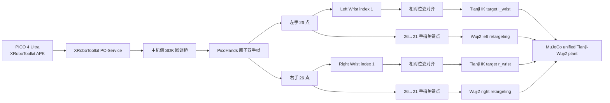

# SPD-VR：XRoboToolkit PICO 到 Tianji-Wuji2 的仿真遥操作设计

## 1. 目标

在 `spd-vr` 仿真分支中，使用 PICO 4 Ultra 上运行的官方 XRoboToolkit 应用提供双手追踪输入。主机通过 XRoboToolkit PC-Service 获取同一时刻的左右手 26 关节姿态，将手指形状重定向到 Wuji2 双手，并将 PICO Wrist 姿态重定向到组合模型中的 `l_wrist` / `r_wrist`，驱动 MuJoCo 中的 Tianji 双臂。

本阶段只实现 PICO 双手到仿真 Tianji-Wuji2 的控制闭环。Manus、VR controller、Palm/SMPL 输入、真实 follower、相机位置和头显场景流送均不属于本阶段。

## 2. 依据与边界

### 2.1 可借鉴的论文机制

原始 SPD 论文中以下机制适用于本项目，并保持为独立于输入设备的仿真基础设施：

- 主机执行仿真和控制，XR 设备提供追踪输入。
- MuJoCo 480 Hz、`implicitfast`、elliptic friction cone、`noslip_iterations=1`。
- 任务 registry 定义 prompt、目标时长、随机 reset；随机采样写入 manifest。
- 原始 episode 保留，超过 10 秒无手-物接触的片段只生成派生过滤结果。
- checkpoint、pause、revert/skip 的 episode 状态机，以及接触期间拒绝 checkpoint。
- RGB/instance-segmentation 数据接口可以保留，但相机外参和相机位置必须在相机方案确定后再冻结。

论文中的 Quest/WebXR、特定场景 mesh 传输、Madrona/MuJoCo Warp 离线渲染和相机配置不能直接视为本项目已确定的实现。它们是后续独立模块。

### 2.2 官方输入依据

输入源采用 XR-Robotics 官方组件：

- 组织页与产品说明：<https://github.com/XR-Robotics>
- Python 遥操作样例：<https://github.com/XR-Robotics/XRoboToolkit-Teleop-Sample-Python>
- PC Service Python binding：<https://github.com/XR-Robotics/XRoboToolkit-PC-Service-Pybind>

官方 binding 的手部接口提供每手 26 个 `[x, y, z, qx, qy, qz, qw]` 姿态、`isActive` 和 `scale`。PICO/OpenXR 手部索引 1 是 Wrist；索引 0 是 Palm，不能混用。

## 3. 系统架构

### 3.1 输入桥

新增或改造主机侧 PICO 输入桥，使一个 SDK 状态回调生成一个不可变 `PicoHands` 快照。快照至少包含：

- `left_joints[26][7]`、`right_joints[26][7]`
- `left_active`、`right_active`
- `left_scale`、`right_scale`
- SDK 状态时间戳
- 单调 `sequence_id`
- tracking `epoch`

左右手、active、scale 和 timestamp 必须来自同一 SDK 回调。不得通过分别读取左右手的轮询接口拼帧。

SDK 初始化、断开和数据解析失败必须显式记录状态；不能把未初始化的全零姿态当作有效手部输入。

### 3.2 手指 retargeting

沿用现有 `PicoHandsInput` 和 `WujiRetargetPair` 的职责边界：

1. 选择 PICO 固定的 21 个 MediaPipe 对应点：
   `[1,2,3,4,5,7,8,9,10,12,13,14,15,17,18,19,20,22,23,24,25]`。
2. 复用 `wuji_retargeting.mediapipe.apply_mediapipe_transformations()`。
3. 不再施加第二次手掌旋转或 controller-to-palm 标定。
4. 左右两个 retargeter 消费同一原子帧，各输出严格的 Wuji2 20-DoF actuator 顺序。
5. 一侧 inactive 或 retarget 失败时只 HOLD 该侧；另一侧继续更新。

Wuji2 retargeting 输出只覆盖手指关节，不覆盖 `l_wrist` / `r_wrist` 的 6-DoF 位姿。

### 3.3 手腕到机械臂

映射是固定且不可替换的：

| PICO 输入 | MuJoCo/URDF 目标 |
|---|---|
| `left_joints[1]` / Left Wrist | `l_wrist` |
| `right_joints[1]` / Right Wrist | `r_wrist` |

`l_wrist` 和 `r_wrist` 是组合 Tianji-Wuji2 URDF/MJCF 中灵巧手的根 link/body。不得改为 `tcp_L` / `tcp_R`、Palm、Controller、SMPL Wrist 或 Manus frame。

每侧机械臂仍是 7-DoF Tianji。IK 任务的末端 frame 使用 `l_wrist` / `r_wrist` 的 link/body 原点；Wuji2 手指关节从该 frame 继续向下连接。

### 3.4 启动相对对齐

当前不使用相机位置，也不要求 PICO tracking space 到 MuJoCo world 的固定绝对外参。每个 tracking epoch 的对齐过程按左右侧独立执行：

1. 等待该侧输入达到稳定窗口；稳定条件包括 active、有限位姿、合法单位四元数和连续 sequence。
2. 读取该侧 PICO Wrist pose。
3. 读取对应的 MuJoCo 当前 Wrist pose（左侧为 `l_wrist`，右侧为 `r_wrist`）。
4. 为该侧保存 PICO 初始 pose 与机器人初始 pose。
5. 后续使用同侧 PICO Wrist 的相对位移和相对旋转更新对应机器人 Wrist target。

位姿运算使用完整 SE(3) 相对变换，不能只对 xyz 做差后直接拼接未经变换的四元数。位置缩放参数必须显式配置并写入 manifest；默认值沿用现有项目约定，除非校准实验另行冻结。

tracking epoch 变化、SDK 断开、输入 stale 或稳定窗口失效时，清除该侧基准并进入 HOLD。恢复必须重新完成对齐，不能沿用旧 epoch 的偏移。

### 3.5 时序

- MuJoCo physics：480 Hz。
- PICO 双手输入和机器人 Wrist target：60 Hz。
- Wuji2 hand retargeting：与同一 60 Hz 原子帧同步。
- Tianji QP IK/底层控制：可以使用更高内部频率，但不得从同一输入帧伪造新的观测时间戳。
- 记录系统保留输入原始 timestamp、sequence 和 epoch。

每个 physics step 只应用最近一个通过 freshness/epoch/validity gate 的同侧目标。过期目标必须进入 HOLD，而不是继续积分旧目标。

### 3.6 脚踏板 pause 与相对位姿离合

`pause` 同时暂停 MuJoCo 物理推进和 episode 记录，并释放 PICO Wrist 到机器人 Wrist 的相对位姿耦合：

1. 按下 `pause` 后，仿真时间、物理状态和 recorder 不再前进；已保存的目标保持不变。
2. 暂停期间不接受新的 PICO Wrist 或 Wuji2 目标作为控制输出，输入帧可以继续接收并仅用于健康检查。
3. 进入暂停时清除左右侧相对对齐基准；恢复时必须使用当前有效 PICO Wrist 与当前 `l_wrist` / `r_wrist` 重新建立各侧基准。
4. 释放 `pause` 后，只有完成该侧稳定窗口和重新对齐的侧别才能恢复控制；未完成侧别继续 HOLD。重新接入不得产生由旧基准造成的 target 跳变。
5. `checkpoint`、`revert` 和 `skip` 仍保持原 episode 语义；checkpoint 仍在手-物接触时拒绝。

## 4. 状态与错误处理

### 4.1 单侧独立性

左、右侧分别维护：

- latest input frame
- last accepted sequence/timestamp
- alignment reference
- hand retarget status
- arm target validity
- HOLD reason

一侧丢失不得冻结另一侧。只有双侧共享的 SDK 断开状态会同时使两侧 HOLD。

### 4.2 输入校验

以下任一条件失败，拒绝对应侧当前帧：

- 26×7 shape 不正确。
- position 或 quaternion 含 NaN/Inf。
- quaternion 不是有限且非零的合法姿态；接受前归一化或拒绝的规则必须统一。
- `scale` 非有限或非正。
- sequence 回退、epoch 不匹配或 timestamp 超过 freshness 窗口。
- Wrist pose 与模型目标之间产生非有限值。
- IK/retargeting 输出超出 manifest 中冻结的 joint limits。

拒绝必须产生结构化 HOLD reason，不能静默回退到 home pose 或零姿态。

### 4.3 安全与范围

本阶段是仿真输入链路，不构成真实机器人安全声明。不得加入真实硬件电流、温度、厂商 safety、急停或 follower 字段作为伪兼容。54-DoF 模型保持 54 DoF，不 padding 到论文的 56 DoF。

## 5. 相机与论文采集机制边界

当前阶段只保留未来采集系统需要的接口，不冻结相机几何：

- 可保留 224×168 RGB 与 instance segmentation 的数据类型和命名接口。
- 不把现有 provisional camera 外参当作正式项目设定。
- 不要求 PICO 头显相机、MuJoCo camera 或视频流参与 Wrist 控制。
- 相机位置、外参、渲染频率、头显 mesh 初始加载和 body-transform streaming 作为后续独立设计。

任务 registry、episode state machine、contact filter 可以继续独立演进，不应阻塞 PICO→Wrist→IK 和 PICO→Wuji2 的闭环。

## 6. 模块变更边界

预计涉及以下现有模块：

- `PICO_tracker/src/pico_bridge/`：接入 XRoboToolkit PC-Service，发布原子双手帧。
- `PICO_tracker/src/spd_vr/spd_vr/pico_hands.py`：保留 26 点校验和索引转换，适配官方 hand state 输入。
- `PICO_tracker/src/spd_vr/spd_vr/retarget_pair.py`：连接官方输入快照与双侧 Wuji2 输出。
- `PICO_tracker/src/spd_vr/spd_vr/simulator.py`：接收双侧手指目标和 Wrist/arm target，执行独立 validity/HOLD。
- `TJ_arm_control/`：将 IK 末端语义从 `tcp_L/tcp_R` 对齐到 `l_wrist/r_wrist`；具体实现必须同时验证 URDF 与 MuJoCo body/site 映射。
- `PICO_tracker/src/spd_vr/generated/tianji_wuji2_spd.xml` 及模型生成逻辑：确认 `l_wrist`、`r_wrist` 作为手根 body 可被 IK 目标解析。
- 启动脚本和配置：改为 XRoboToolkit PC-Service 输入，不启动 Manus 或旧的控制器输入链路。

不在本阶段新增相机外参文件、真实硬件适配器或另一套手部协议。

## 7. 验证要求

必须覆盖真实可观察契约：

1. 官方 XR JSON/SDK fixture 能生成单个原子双手快照，左右手 timestamp/sequence 一致。
2. PICO 左 Wrist 只影响 `l_wrist` 目标和左 Tianji 7-DoF；右侧不被修改。
3. PICO 右 Wrist 只影响 `r_wrist` 目标和右 Tianji 7-DoF；左侧不被修改。
4. 手指姿态只改变对应 Wuji2 20 个关节，Wrist root 不被 retargeter 覆盖。
5. 启动相对对齐保持初始姿态连续；已知 Wrist 平移/旋转能产生对应 target 变化。
6. 单侧 inactive、stale、非法四元数和 retarget 失败只让对应侧 HOLD。
7. epoch 变化会清除旧基准，重新稳定后才能恢复。
8. MuJoCo 运行 smoke scenario 时，模型成功解析 `l_wrist` / `r_wrist`，并保持 54-DoF。
9. 现有 task reset、episode recorder 和 contact-free checkpoint 契约不因输入替换而退化。

不以相机位置、头显视频流或真实机器人运动作为本阶段验收条件。
