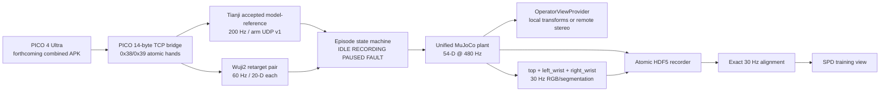

# SPD 复现实际 Setting：PICO + XRoboToolkit + Tianji + Wuji2

## 1. 最终技术决策

本 Setting 当前只定义 `spd-vr` 仿真分支。真实 Tianji SDK、Wuji2 Ethernet backend、厂家安全参数和硬件急停全部后置到 `spd-teleop`；forthcoming combined PICO APK 尚未进入仓库。

| 层 | 本项目选择 | 用途 |
|---|---|---|
| XR 设备 | **PICO 4 Ultra** | 头部与双手 26-joint OpenXR tracking；操作者显示 |
| XR 软件 | forthcoming `pico_wholebody_stream.apk` + PICO bridge | 14-byte TCP frame；双手原子 frame |
| 双臂 | **Tianji，7 DoF/arm** | MuJoCo 中的 14-D arm target |
| 双手 | **Wuji2，20 DoF/hand** | MuJoCo 中的 40-D position target |
| 机器人模型 | `assets/tianji_wuji2/tianji_wuji2.urdf` | fixed mount transforms 与 54-D manifest 来源 |
| 仿真 | MuJoCo `implicitfast` | 480 Hz 接触仿真、六场景、预训练数据 |
| 手臂控制 | `TJ_arm_control` 当前 SPARK/qpOASES 配置 | 200 Hz `model_reference`，UDP v1 输出 15100 |
| 手部 retarget | `wuji-retargeting` Adaptive Hand2 config | PICO 26 点→MediaPipe 21 点→Wuji2 20 joints |
| 训练观测 | `top`、`left_wrist`、`right_wrist` | 224×168 RGB/segmentation；PICO 头显流不入策略 |
| 操作状态机 | `/pico/record_flag` + console | start/checkpoint、pause/resume、revert/skip、finish |

**关键边界：**`spd-vr` 不加载真实硬件 adapter、Wuji2 Ethernet backend、厂家 safety 值或硬件急停。XR 输入只通过 `0x38/0x39` 双手帧进入 host；`/pico/hands` 是唯一双手 ROS 合同。当前相机标定为 `provisional-v1`，样本未到位前不得开始正式 75 h 采集。

当前目标头显为 **PICO 4 Ultra**。APK/PC ingress 版本尚未冻结；交付后必须先验证 `0x38/0x39`、双 timestamp 配对、断线 epoch 和 operator-view readiness，不能把某个现有 XRoboToolkit release 当作已固定依赖。

---

## 2. 选择理由与相对论文的变化

### 2.1 保持不变

- 目标本体内仿真遥操作，而不是人手视频离线 retarget；
- MuJoCo 480 Hz；200 Hz arm target、60 Hz hand target/supervisor、30 Hz camera/record；
- 六场景、约 75 h pilot/corpus 目标、五操作者；
- 54-D robot qpos/action、三路相机、224×168 训练图像；
- 256-step history、32-step attention window、8-step action chunk；
- `spd-teleop` 的真实五任务、from-scratch BC 对照和 `w×c` 消融不在当前分支。

### 2.2 必要替换

| 论文 | 本项目 | 影响 |
|---|---|---|
| Quest 3 WebXR | PICO 4 Ultra + forthcoming combined APK/OpenXR | 等待 APK 合同验证；不得假定固定 XRoboToolkit ingress |
| 仿真中 Quest hand tracking | PICO 26-joint hand tracking | 通过 `0x38/0x39` 原子双手帧；手更新目标 60 Hz |
| 真实中 Quest controller + Manus | `spd-teleop` 后置硬件输入 | 当前 `spd-vr` 不加载 Manus、controller-to-palm 或实机 follower |
| 6-DoF YAM + 22-DoF Sharpa/side | 7-DoF Tianji + 20-DoF Wuji2/side | 策略维度 56→54；当前仿真统一 54 DoF |
| 原 `spd-vr` | 本仓库 `spd-vr` simulator/recorder + provisional camera API | MuJoCo body transform 下行由 operator provider 负责 |

真实手套、实机 follower、厂家安全参数和硬件急停只在 `spd-teleop`。当前分支只做仿真与 mock/pilot；PICO hand readiness、sample validator、模型与相机合同全部通过后才允许正式采集。

---

## 3. 软件与网络基线

### 3.1 初始版本基线

| 组件 | 基线 |
|---|---|
| 工作站 | Ubuntu 24.04 x86_64 |
| PICO | PICO 4 Ultra（目标设备；具体 OS/APK 版本待验证） |
| PICO APK | forthcoming `pico_wholebody_stream.apk`，必须实现 `0x38/0x39` |
| PC ingress | PICO bridge 14-byte TCP frame；XRoboToolkit Unity Client 仅作兼容构建路径 |
| Python | Pixi lockfile 中的 Python 3.11 |
| Wuji retarget | editable local `wuji-retargeting`；`wuji-sdk` 只属于 hardware extra |
| MuJoCo | Pixi lockfile；统一模型 `tianji_wuji2_spd.xml` |
| 相机 | `config/sim_cameras.yaml`，`calibration_revision: provisional-v1` |

APK、依赖、MJCF 和样本 SHA-256 在 manifest 中记录；当前不把某个 APK、PC Service 或 fixed XR ingress 声称为已冻结事实。

### 3.2 网络拓扑

- PICO 与 XR 工作站连接同一台专用 Wi-Fi 6/6E AP；AP 与工作站有线连接。
- 机器人控制总线、相机和磁盘写入不经过 PICO 无线链路。
- XR 网络单独 SSID/VLAN，不承载训练数据同步或互联网下载。
- 采集时锁定 AP channel；关闭省电、自动漫游和后台大流量任务。
- 工作站使用统一 monotonic clock；相机、机器人和 XR timestamp 都映射到该时基。

门槛：XR packet loss <1%；60 Hz hand frame 到达率 ≥99%；XR frame 在 retarget 读取时的 age，P95 ≤25 ms、P99 ≤50 ms；连续缺帧 >100 ms 立即进入 HOLD。

---

## 4. PICO wire 与输入合同

### 4.1 Host frame

PICO host 端保留现有 14-byte little-endian frame header：

```text
[magic:u8=0xAB][type:u8][ts_ms:i64][payload_len:u32]
```

body pose 继续使用 `0x20..0x37` 与 `xyz + quaternion_xyzw` 的 7×`float32`。双手只使用：

- `0x38`：左手；`0x39`：右手；
- payload 固定 733 bytes：`active:u8`、`scale:f32`、26×`xyz + quaternion_xyzw:f32`；
- 26 点顺序固定为 `Palm, Wrist, Thumb(4), Index(5), Middle(5), Ring(5), Little(5)`；
- 位置单位米；`active=0` 时该侧不得进入 retarget；
- 只有左右 `ts_ms` 完全相同且 tracking epoch 相同，才发布一个 `/pico/hands`。

`PicoHands.msg` 是唯一 ROS 双手合同：包含 header、tracking epoch、receiver sequence、左右 active/scale 和左右 26 个 `geometry_msgs/Pose`。

### 4.2 原子消费与模式边界

PICO bridge 在收到完整 wire payload 后一次性提交 immutable hand snapshot。timestamp 更新会清空未配对侧；TCP 重连和 `TYPE_WORLD_RESET` 会清空累加器并进入新 epoch。消费者不得把不同 sequence 的左右手拼成一帧。

`spd-vr` 使用 `/pico/hands` 的 OpenXR Palm joint 0 发布 `/pico/palm_left/right`；`start_spd_vr.sh` 固定 `palm_source:=optical_hand`，不启动 controller→palm publisher，也不读取 `T_controller_palm` artifact。原 `start_tianji_pico_teleop.sh` 继续使用 controller source。

forthcoming combined APK 尚未冻结。若 host 收不到 `0x38/0x39`，live hand readiness 必须失败；不能用 controller pose 伪造 optical hand。兼容 APK 只能使用 [spd_vr_apk_contract.md](./PICO_tracker/docs/spd_vr_apk_contract.md) 中的单一 wire contract。

### 4.3 输入模式

当前主路径是 **PICO optical-hand sim-only mode**：

- arm target：现有 Tianji SPARK/qpOASES 200 Hz controller 的 accepted model-reference；
- Wuji2：PICO 26 joints 经共享 MediaPipe/MANO frame 变换后进入左右 Adaptive retargeter；
- 控制命令：`/pico/record_flag` 与 console 统一进入 `EpisodeCommand` queue；
- controller 与 optical hand 不要求同时 active；inactive 侧单独 HOLD。

---

## 5. 端到端系统拓扑



### 5.1 进程边界

```text
pico_driver             PICO TCP source
pico_bridge             body stream + atomic 0x38/0x39 hands
pico_optical_palm       PicoHands joint 0 -> /pico/palm_left/right
tianji_arm_controller   existing SPARK/qpOASES model-reference @ 200 Hz
wuji2_retarget_pair     two Adaptive Hand2 Retargeters @ 60 Hz
episode_supervisor      54-D validation, HOLD, checkpoint/revert
mujoco_sim              one unified model/data pair @ 480 Hz
operator_view           local body transforms or remote stereo only
camera_provider         top/left_wrist/right_wrist @ 30 Hz
episode_recorder        staging HDF5 + manifest/checksum + atomic publish
align/filter/replay     offline 30 Hz view, contact audit, deterministic replay
```

ROS callbacks和 UDP receive 线程只替换 immutable snapshots；MuJoCo `mjData` 只由 physics thread 在 tick boundary 修改。当前分支不存在 arm/hand hardware follower。

---

## 6. PICO 仿真显示方案


操作者显示与策略相机分离：

1. forthcoming APK 支持 local scene rendering 时，`OperatorViewProvider` 只下发当前 MuJoCo body transforms；
2. 否则使用 XRoboToolkit Unity Client 的 remote-vision path，从当前 PICO head pose 请求 1280×720、60 Hz stereo pair；
3. 头显视图不写入 `top`、`left_wrist`、`right_wrist` 数据集；
4. policy camera provider 仍由 MuJoCo 直接输出 224×168 RGB 与 instance segmentation；
5. pause/revert 后下发新的 state epoch，丢弃旧 epoch 的 operator snapshot；
6. motion-to-photon P95 必须小于 120 ms，否则 live collection readiness 失败。

当前 APK 尚未交付，因此 local/remote 具体 ingress 只在 readiness 通过后冻结；不并行启动两个 PICO 前台应用。

## 7. 坐标系与标定

### 7.1 固定 frame

| 名称 | 定义 |
|---|---|
| `X` | PICO OpenXR world，应用启动原点 |
| `B` | Tianji `Link_Base` |
| `S` | 任务 scene/table frame |
| `E_L/E_R` | `TCP_Link_L/TCP_Link_R` |
| `P_L/P_R` | Wuji2 `l_wrist/r_wrist` palm frame |
| `H_L/H_R` | PICO Wrist/Palm tracking frame |
| `C_T/C_L/C_R` | top/left/right D405 optical frame |

禁止在代码中散布轴交换和符号翻转。所有变换由一个版本化 `frame_manifest.yaml` 提供。

### 7.2 PICO→Tianji arm target

PICO body/wrist pose 继续进入现有 TJVR v4 bridge；`TJ_arm_control` 保留当前 `spark_upper_qpoases_headroom_feedforward_velocity_qp`、200 Hz velocity control、`model_reference` 和 `config/qp_ik_pico_teleop.yaml`。

controller 在每个 200 Hz commit、`robot.setArmState(...)` 之后发送 accepted model-reference UDP v1：

```text
SPDA | version:u16=1 | packet_size:u16=272
     | sequence:u64 | tracking_epoch:u64
     | source_timestamp_ns:u64 | control_timestamp_ns:u64
     | valid_mask:u8 | hold_reason:u8 | reserved:u16
     | left_q/right_q/left_qdot/right_qdot: 4×7 float64 | CRC32
```

stale、solver failure、paused 仍发送最后安全 `q/qdot`，但清除对应 valid bit；统一仿真只在 tick boundary 接受 immutable snapshot。该协议的 Python decoder 与 C++ fixture 位级一致。

### 7.3 PICO 手→Wuji2 retarget

PICO 26 点经固定索引 `[1,2,3,4,5,7,8,9,10,12,13,14,15,17,18,19,20,22,23,24,25]` 转成 MediaPipe 21 点。`PicoHandsInput` 只做索引选择并调用 `wuji_retargeting.mediapipe.apply_mediapipe_transformations()`；不重复旋转，输出单位米且 Wrist 为原点。

Wuji2 每手求解 20 joints：

- thumb：CMC flex、CMC abd、MCP、IP；
- index/middle/ring/little：MCP flex、MCP abd、PIP、DIP。

左右各持有一个 `Retargeter`。同一原子 `PicoHands` frame 同时求左右 target；任一侧 inactive 时仅该侧 HOLD，另一侧继续。epoch 变化调用 `reset_filter()`。URDF/Pinocchio 输出通过严格的 `qpos_reorder_perm` 转为官方 Hand2 MJCF actuator 顺序，mapping 缺失直接失败。

用户样本到位并通过 validator 前，`segment_scaling`、`lp_alpha`、`norm_delta` 和 pinch thresholds 只保留 provisional 零/默认值；最终 YAML 与样本 SHA-256 一起冻结。

### 7.4 相机标定

三路策略相机逻辑名固定为 `top`、`left_wrist`、`right_wrist`，分辨率 `uint8[168,224,3]` 与 `int32[168,224,2]`。`config/sim_cameras.yaml` 的 `calibration_revision` 当前为 `provisional-v1`：

- `top`：parent=`world`，position `[0.50,0.00,1.80]`，look-at `[0.45,0.00,1.05]`；
- `left_wrist`：parent=`l_wrist`，position `[-0.035,0.000,0.005]`，look-at `[0.000,0.000,-0.150]`；
- `right_wrist`：parent=`r_wrist`，position `[0.035,0.000,0.005]`，look-at `[0.000,0.000,-0.150]`。

MuJoCo builder 从 position/look-at 计算旋转；未来只替换 YAML、提升 revision 并从空 dataset 开始。PICO 头显双目/鱼眼流只服务 OperatorViewProvider。

---

## 8. 频率、缓冲和动作合同

| 层 | 频率 | 合同 |
|---|---:|---|
| PICO TCP frame | body/controller existing rate + hand 60 Hz | 14-byte header；0x38/0x39 fixed payload |
| PICO hand joints | 60 Hz | 每手 26×7 + active/scale；同 timestamp 原子配对 |
| Arm target | 200 Hz | accepted model-reference UDP v1，272 bytes |
| Hand target/supervisor | 60 Hz | 20-D/side；inactive 单侧 HOLD |
| MuJoCo physics | 480 Hz | tick boundary 读取 latest snapshot |
| Strategy cameras | 30 Hz | top/left_wrist/right_wrist RGB + segmentation |
| Training grid | 30 Hz | 54-D obs/action + 3 RGB |
| Policy deployment | 30 Hz | 8-step action chunk，rolling KV cache |

54-D joint 顺序唯一：

```text
left arm 7
left Wuji2 20: thumb 4, index 4, middle 4, ring 4, little 4
right arm 7
right Wuji2 20: thumb 4, index 4, middle 4, ring 4, little 4
```

每个 arm packet 带 `source_timestamp_ns`、`control_timestamp_ns`、`sequence`、`tracking_epoch`、valid mask 和 hold reason。sim supervisor 拒绝非有限值、旧 epoch、逆序 sequence、越界 q 或超 velocity limit；无效侧保持最后安全 target。

---

## 9. 状态机与脚踏板/console

```text
IDLE → RECORDING → PAUSED → RECORDING
  └──────────────→ IDLE（finish/skip）
RECORDING/PAUSED → FAULT
```

当前命令 producer：

- `/pico/record_flag`：true=start，false=finish；
- console `s`：start；`c`：contact-free checkpoint；`p`：pause/resume；
- console `r`：revert；`k`：skip/discard；`f`：finish。

所有 producer 只写入 `EpisodeCommand` queue，不直接操作 recorder。checkpoint 保存 `mjSTATE_FULLPHYSICS`、mocap、task RNG、episode counters 和 state epoch，且仅在双手均无 task-object contact 时允许；revert 后旧 camera/target snapshot 全部丢弃。

---

## 10. 当前分支运行模式

### 10.1 `SIM_PRETRAIN`（本分支）

- forthcoming PICO combined APK 或 mock server 提供 body + atomic hands；
- Tianji arm target 来自现有 SPARK/qpOASES accepted model-reference；
- Wuji2 两侧使用官方 Hand2 URDF/MJCF 与 strict actuator mapping；
- unified MuJoCo plant 480 Hz，arm 200 Hz，hand/supervisor 60 Hz，camera/record 30 Hz；
- 记录完整模拟状态、PICO raw hands、54-D command、contact 与 sampled task manifest；
- 后处理为精确 30 Hz 三相机训练数据；
- 用于 pilot；样本/标定/ready gates 全部通过后才可正式 75 h。

### 10.2 `REAL_FINETUNE`（`spd-teleop` 后置）

真实 follower、Manus/其他硬件输入、厂家 safety 参数、急停和真实相机只在 `spd-teleop` 分支实现。本分支不提供伪 hardware adapter，不把仿真 recorder schema 扩展为真实硬件字段。

---

## 11. 数据与模型 Setting

### 11.1 训练样本

raw episode 写入 `data/spd_vr/episodes/<episode_id>/episode.hdf5` 与 `manifest.json`：

```text
observations/qpos: float64[N,54]
observations/qvel: float64[N,54]
actions/qpos_target: float64[N,54]
cameras/{top,left_wrist,right_wrist}/rgb: uint8[M,168,224,3]
cameras/{top,left_wrist,right_wrist}/segmentation: int32[M,168,224,2]
pico/hands/{left,right}_hand: float32[K,26,7]
pico/hands/{left,right}_active: bool[K]
pico/hands/{left,right}_scale: float32[K]
pico/hands/{sequence_id,tracking_epoch}: uint64[K]
timestamps/*: 原始 simulator/physics timestamp
task_reset_manifest: seed + sampled physical/object values
```

PICO raw hands、active/scale、retarget status、validity mask 和 contacts 都写入
episode，但不输入 SPD policy。没有真实硬件字段。

离线对齐只选 `image_timestamp <= sample_timestamp` 的最近过去图像，age >50 ms 或缺帧直接使 clip 验证失败；robot/action 只取 60 Hz raw stream 的偶数 sequence 形成精确 30 Hz grid。

### 11.2 SPD 模型
维持主计划：

- 54-D proprioception 和 previous action；
- frozen DINOv3 ViT-B/16；
- 每相机 4 visual queries；
- 8 transformer blocks、hidden 768、12 heads、MLP×4；
- 256 steps @30 Hz；
- sliding window 32；action chunk 8；image stride 8；
- flow matching，10 Euler inference steps；
- batch 64、LR 1e-3 constant、weight decay 0.1；
- Muon + AdamW；EMA half-life 20；170k pretrain steps。

XR/PICO 数据不新增为模型条件，避免把本 Setting 变成另一种方法。

### 11.3 实验组

主组：

- SPD pre-trained：通过样本、model、camera readiness 后的 75 h 仿真数据预训练；真实 fine-tune 只在 `spd-teleop`；
- BC from-scratch：相同后置真实数据、架构和 steps，从随机初始化训练。

消融：`window ∈ {1,32}` × `chunk ∈ {8,32}`，每种分别 pre-trained/scratch；当前分支只冻结仿真输入和 replay 合同。

---

## 12. 当前分支安全与质量门禁

### P0：PICO wire readiness

- forthcoming combined APK/mock server 可发送 14-byte header、`0x38/0x39`；
- payload 恰为 733 bytes，26-joint order、xyz+quat_xyzw、metre 单位正确；
- 左右 timestamp/epoch 原子配对；inactive 只产生该侧 HOLD；
- TCP reconnect/world reset 清空 pending hands 并进入新 epoch；缺 hand types 时 live readiness 明确失败。

### P1：样本与坐标

- NPZ 文件名固定为 `data/pico_hand_samples/raw/pico_hands_60s.npz`；
- dtype/shape、严格递增 timestamp/sequence、有限数、quat norm 和 active 完整性通过 validator；
- PICO→MediaPipe 固定 26→21 index，Wrist 原点，左右 MANO 变换只调用共享函数。

### P2：Wuji2 与 arm target

- 左右各一个官方 Hand2 `Retargeter`，20-D 输出严格按 manifest actuator name 重排；
- inactive、solver failure、旧 epoch/sequence 和越界 target 只 HOLD 对应侧；
- arm UDP v1 为 272 bytes，CRC/finite/epoch/sequence/freshness 校验通过；
- accepted model-reference 从 200 Hz Tianji controller commit 输出，paused/stale 仍发送最后安全 target 并清 valid bit。

### P3：unified simulation

- generated model、manifest 和 calibration 恰为 54 joints/actuators；
- MuJoCo `implicitfast`、480 Hz；tick boundary 才写 `mjData`；
- 三 camera 固定返回 RGB `uint8[168,224,3]` 与 segmentation `int32[168,224,2]`；
- seed reset、object dimensions/physics/color、instance IDs 和 contact gate 可重放。

### P4：episode data

- raw 60 Hz robot/action 与 raw hands、30 Hz camera、objects、contacts、manifest/checksum 原子发布；
- checkpoint 仅在无 hand-object contact 保存 full physics/mocap/RNG；revert 丢弃旧 snapshot；
- 30 Hz 对齐不插值，图像只取过去最近帧且 age ≤50 ms；
- 连续无接触 span 超过 10 s 时保留原 episode 并生成过滤审计。

### R1–R3：`spd-teleop` 后置门禁

真实 follower、Manus/其他硬件输入、厂家安全参数、硬件急停、sim/real 对齐和真实 PICO tracking readiness 不在 `spd-vr`。这些门禁只能在 `spd-teleop` 分支实现并单独验收；当前分支不得通过仿真结果宣称实机安全或开始实机采集。

### D1：数据准入

- 100% episode 具备三图、54-D obs/action、单调 timestamp、版本和 checksum；
- 无未来图像对齐；
- 无接触 >10 s 片段按论文规则裁剪；
- episode 可从 reset seed 和初始 state 重建。

---

## 13. 实施顺序

1. 建立根仓库 baseline，创建并切换 `spd-vr`；保留 submodule commit 和锁文件。
2. 实现 `PicoHands` wire/ROS 合同、mock cases、样本 schema/validator。
3. 建立 `spd_vr` adapter、官方 Hand2 YAML、双手 strict retarget/HOLD。
4. 保留 Tianji SPARK/qpOASES 200 Hz model-reference，增加 272-byte arm UDP v1。
5. 生成 unified 54-DoF MJCF、manifest、actuator calibration 和三相机 provisional provider。
6. 完成六场景 procedural reset、episode state machine、atomic HDF5 recorder 和 replay。
7. 运行 mock/pilot smoke；样本与相机 revision 未冻结前不开始正式 75 h。
8. 后续在 `spd-teleop` 单独实现真实 follower、hardware safety、真实输入和实机 gate。

---

## 14. 代码边界

```text
PICO_tracker/src/pico_bridge/
  pico_frame.hpp                 14-byte header + 0x38/0x39 hand payload
  pico_hand_pairing.hpp          atomic timestamp/epoch pairing
  PicoHands.msg                  unique ROS hand contract
  pico_optical_palm_publisher.py joint 0 passthrough
PICO_tracker/src/spd_vr/
  pico_hands.py                  26→21 MediaPipe adapter
  retarget_pair.py               two official Hand2 Retargeters
  model_builder.py               unified 54-DoF MJCF
  simulator.py                   one mjModel/mjData, 480/200/60/30 Hz
  camera.py / operator_view.py   policy/operator view separation
  episode.py / recorder.py       state machine and atomic HDF5
TJ_arm_control/
  arm_target_protocol.*           272-byte UDP v1
  apps/run_qp_ik_viewer.cpp      accepted model-reference output
```

`spd-vr` 不引入第三方硬件 adapter，不读取 `T_controller_palm` artifact，不修改 `assets/tianji_wuji2/tianji_wuji2.urdf`。`wuji-sdk` 与所有真实 follower 只在 `spd-teleop` 的 hardware extra/实现中出现。

---

## 15. 一句话 Setting
**PICO 4 Ultra forthcoming combined APK 以 60 Hz 原子双手 26 点驱动现有 Tianji SPARK 200 Hz arm target 与 Wuji2 双 20-DoF hand retarget；统一 MuJoCo 480 Hz 生成 54-D 仿真 episode，`top/left_wrist/right_wrist` 三路 provisional camera 按 30 Hz 对齐，正式 75 h 与全部实机工作后置到 `spd-teleop`。**

### 官方依据

- [XRoboToolkit 官方入口](https://github.com/Pico-Developer/XRoboToolkit)
- [XR Robotics 官方组织与安装说明](https://github.com/XR-Robotics)
- [XRoboToolkit Python sample](https://github.com/XR-Robotics/XRoboToolkit-Teleop-Sample-Python)
- [PC Service Python binding](https://github.com/XR-Robotics/XRoboToolkit-PC-Service-Pybind)
- [XRoboToolkit 论文与数据合同](https://xr-robotics.github.io/)
