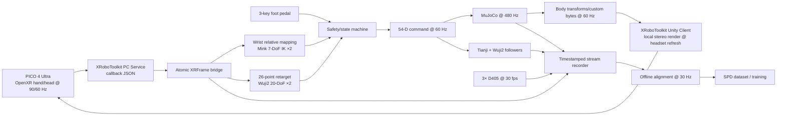

# SPD 复现实际 Setting：PICO + XRoboToolkit + Tianji + Wuji2

## 1. 最终技术决策

本 Setting 用以下实际平台替换论文的 Quest/Manus/YAM/Sharpa 栈：

| 层 | 本项目选择 | 用途 |
|---|---|---|
| XR 设备 | **PICO 4 Ultra** | 头部、双手 26-keypoint OpenXR tracking；仿真场景显示 |
| XR 软件 | **XRoboToolkit** | PICO Unity Client、PC Service、XR 数据传输、Python/C++ SDK |
| 双臂 | **Tianji，7 DoF/arm** | 左右 TCP 位置控制 |
| 双手 | **Wuji2，20 DoF/hand** | 五指连续关节位置控制 |
| 机器人模型 | `assets/tianji_wuji2/tianji_wuji2.urdf` | 54-DoF 运动学源模型 |
| 仿真 | MuJoCo | 480 Hz 接触仿真、六场景、预训练数据采集 |
| 手臂 IK | Mink differential IK | 保持 SPD 的 IK 路线；每 tick 4 次 QP |
| 手部 retarget | `dex-retargeting` 自定义 Wuji2 config | PICO 26 点→Wuji2 20 joints |
| 训练观测 | 顶部 1 + 左右腕部各 1 个 D405 | 策略三视图；PICO 图像不进入策略 |
| 操作状态机 | 三键脚踏板 + 硬件急停 | engage/checkpoint、pause、revert/skip、安全停机 |

**关键边界：**XRoboToolkit 负责 XR tracking、通信和 PICO 客户端，不替代 SPD 的机器人控制、数据合同、模型和实验协议。官方 Python sample 的 Placo、通用 logger 和机器人样例只作为参考；主路径统一使用 Mink、项目自有 54-D schema 和 SPD 训练协议。

本 Setting 默认头显为 **PICO 4 Ultra**，因为这是 XRoboToolkit 官方明确支持并测试的 PICO 型号。若实际设备不是 PICO 4 Ultra，必须先通过 P0 兼容性门禁；不能假定其他 PICO 型号具备同样的 OpenXR hand tracking、APK、OS 和 Motion Tracker 支持。

---

## 2. 选择理由与相对论文的变化

### 2.1 保持不变

- 目标本体内仿真遥操作，而不是人手视频离线 retarget；
- MuJoCo 480 Hz；控制、tracking 消费和记录 60 Hz；训练 30 Hz；
- 六场景、约 75 h、五操作者；
- 54-D robot qpos/action、三路相机、224×168 训练图像；
- 256-step history、32-step attention window、8-step action chunk；
- 真实五任务、from-scratch BC 对照和 `w×c` 消融。

### 2.2 必要替换

| 论文 | 本项目 | 影响 |
|---|---|---|
| Quest 3 WebXR | PICO 4 Ultra + XRoboToolkit/OpenXR | XR 原点、坐标和时间戳按 XRoboToolkit 合同处理 |
| 仿真中 Quest hand tracking | PICO 26-joint hand tracking | 直接提供 palm、wrist 和五指 joints；手更新 60 Hz |
| 真实中 Quest controller + Manus | PICO optical hand tracking | 少一套手套，但真实接触遮挡风险更高，必须通过 R3 gate |
| 6-DoF YAM + 22-DoF Sharpa/side | 7-DoF Tianji + 20-DoF Wuji2/side | 策略维度 56→54；Tianji 多余 DoF 用于 posture/null-space |
| 原 `spd-vr` | XRoboToolkit Unity/PC Service + 项目桥接层 | 需要增加仿真 body-state 下行和脚踏板状态机 |

不使用 Manus 是有条件决策，不是假定 PICO optical tracking 与 Manus 等价。若真实任务中 hand tracking 有效率、tip 抖动或遮挡恢复不达标，真实数据采集不得开始；优先增加两枚 PICO Motion Tracker 做腕部跟踪，PICO hand tracking 只负责手指。仿真预训练仍使用纯 PICO hand tracking。

---

## 3. 软件与网络基线

### 3.1 初始版本基线

| 组件 | 基线 |
|---|---|
| 工作站 | Ubuntu 24.04 x86_64 |
| PICO | PICO 4 Ultra，User OS > 5.12 |
| PICO APK | `XRoboToolkit-PICO-1.1.1.apk` |
| PC Service | `XRoboToolkit-PC-Service v1.0.0` Ubuntu 24.04 package |
| Python | 3.10 |
| Python SDK | `XRoboToolkit-PC-Service-Pybind`，固定 commit |
| 样例参考 | `XRoboToolkit-Teleop-Sample-Python`，固定 commit |
| Unity Client | `XRoboToolkit-Unity-Client`，从 v1.1.1 tag 建项目 fork |
| MuJoCo/Mink/dex-retargeting | 首个通过 P0–P2 的版本写入 lockfile，之后冻结 |

XRoboToolkit Python sample 的 `pyproject.toml` 没有固定 MuJoCo、NumPy、Placo、Torch 和 `dex_retargeting` 版本，不能直接作为可复现环境。项目必须生成自己的 lockfile，并记录 APK、deb、Git commits、DINOv3 权重和所有派生 MJCF 的 SHA-256。

### 3.2 网络拓扑

- PICO 与 XR 工作站连接同一台专用 Wi-Fi 6/6E AP；AP 与工作站有线连接。
- 机器人控制总线、相机和磁盘写入不经过 PICO 无线链路。
- XR 网络单独 SSID/VLAN，不承载训练数据同步或互联网下载。
- 采集时锁定 AP channel；关闭省电、自动漫游和后台大流量任务。
- 工作站使用统一 monotonic clock；相机、机器人和 XR timestamp 都映射到该时基。

门槛：XR packet loss <1%；60 Hz hand frame 到达率 ≥99%；XR frame 在 retarget 读取时的 age，P95 ≤25 ms、P99 ≤50 ms；连续缺帧 >100 ms 立即进入 HOLD。

---

## 4. XRoboToolkit 数据合同

### 4.1 官方输入

XRoboToolkit 采用 OpenXR 右手坐标系：

- `+X`：右；
- `+Y`：上；
- `+Z`：后；
- 应用启动时以操作者头部位置建立 XR 原点；
- pose 排列：`[x, y, z, qx, qy, qz, qw]`；
- 所有 tracking 数据封装在一个 JSON object 中以 90 Hz 发送；
- optical hand tracking 因相机限制以 60 Hz 更新；
- 每手 26 个 OpenXR joints；
- `isActive` 表示手部 tracking 是否有效；
- `timeStampNs` 为 XR 帧时间戳。

26 点顺序固定为：

```text
0 Palm
1 Wrist
2–5 Thumb: metacarpal, proximal, distal, tip
6–10 Index: metacarpal, proximal, intermediate, distal, tip
11–15 Middle: metacarpal, proximal, intermediate, distal, tip
16–20 Ring: metacarpal, proximal, intermediate, distal, tip
21–25 Little: metacarpal, proximal, intermediate, distal, tip
```

### 4.2 必须修正的 SDK 使用方式

官方 Pybind 当前把 controller、head、left hand、right hand 和 timestamp 存在不同全局数组及不同 mutex 中。逐函数读取可能组合出跨帧数据。主路径不得直接连续调用多个 getter 形成一帧。

项目 fork 必须提供单一原子 API：

```python
XRFrame(
    timestamp_ns: int,
    head_pose: float[7],
    left_hand: float[26, 7],
    right_hand: float[26, 7],
    left_active: bool,
    right_active: bool,
    left_scale: float,
    right_scale: float,
    hand_mode: int,
    sequence_id: int,
)
```

在 PC Service callback 中解析完一个 JSON 后一次性提交 immutable snapshot。消费者只通过 `get_latest_frame(after_sequence_id)` 读取；禁止把不同 sequence 的左右手或 timestamp 拼接在一起。

### 4.3 输入模式

主采集模式为 **bare-hand mode**：

- arm target 使用每手 Wrist/Palm pose；
- Wuji2 retarget 使用 26 hand joints；
- 控制 engage、checkpoint、pause 和 revert 不依赖手柄按钮，全部交给脚踏板；
- 不假定 PICO 能同时稳定输出 controller 和 optical hand tracking。

右手柄 B 键 logger 只用于官方 sample，不进入本 Setting。真实和仿真使用同一脚踏板状态机。

---

## 5. 端到端系统拓扑



### 5.1 进程边界

```text
xrt_pc_service          官方 C++ service
xrt_frame_bridge        原子 XRFrame + 健康状态
foot_pedal              脚踏板事件与去抖
arm_retarget_left       左腕 relative target + Mink
arm_retarget_right      右腕 relative target + Mink
hand_retarget_left      PICO 26 点 → Wuji2 20 joints
hand_retarget_right     PICO 26 点 → Wuji2 20 joints
command_supervisor      54-D 合并、限位、状态机、watchdog
mujoco_sim              480 Hz 仿真与 contact
unity_scene_streamer    静态资产一次下发、动态 body transform 60 Hz
arm_follower_left/right Tianji 硬件 adapter
hand_follower_left/right Wuji2 硬件 adapter
camera_top/left/right   三相机 publisher
recorder                每流 timestamped HDF5
```

内部通信采用 ZeroMQ IPC。XRoboToolkit PC Service 只负责 PICO 链路；不把所有机器人进程塞进 Unity 或 PC Service。

---

## 6. PICO 仿真显示方案

SPD 预训练需要操作者在头显中直接看到虚拟场景。XRoboToolkit 默认 tracking/remote-vision 能力不足以自动获得 SPD 的可重建 MuJoCo 场景，因此使用 Unity Client 的最小 fork：

1. 场景启动时，工作站通过 `PXREASendBytesToDevice` 一次性发送静态 mesh、材质、body ID、相机/光源和 scene manifest。
2. Unity 缓存静态资产；运行时只接收自由体和机器人 link 的 pose、可见性及少量材质随机化参数。
3. MuJoCo 以 480 Hz 运行；动态 body state 以 60 Hz 下发。
4. Unity 在 PICO 本地按头显刷新率进行 stereo render；body pose 做有界插值，不外推物理状态。
5. 操作者视图中的 Tianji arm link 半透明；Wuji2、对象和接触区保持不透明。
6. 训练相机图像由离线 MuJoCo/Madrona 路径生成，绝不截取操作者 Unity 视图。
7. pause/revert 后下发完整 state snapshot 和新的 sequence epoch，丢弃旧 epoch 的延迟包。

优先本地 Unity mesh 渲染，而不是从工作站发送压缩 stereo video：这减少视频编码延迟，并最接近 SPD 的“主机仿真、头显客户端渲染”结构。XRoboToolkit Remote Vision 只用于真实机器人远程观察或调试，不作为仿真主显示路径。

---

## 7. 坐标系与标定

### 7.1 固定 frame

| 名称 | 定义 |
|---|---|
| `X` | PICO OpenXR world，应用启动原点 |
| `B` | Tianji `Link_Base` |
| `S` | 任务 scene/table frame |
| `E_L/E_R` | `TCP_Link_L/TCP_Link_R` |
| `P_L/P_R` | Wuji2 `l_wrist/r_wrist` palm frame |
| `H_L/H_R` | PICO Wrist/Palm tracking frame |
| `C_T/C_L/C_R` | top/left/right D405 optical frame |

禁止在代码中散布轴交换和符号翻转。所有变换由一个版本化 `frame_manifest.yaml` 提供。

### 7.2 XR→机器人相对腕控制

按 SPD 使用 clutch-relative 控制。脚踏板 engage 的瞬间保存：

- PICO 手腕锚点 `T_XH(0)`；
- 机器人 TCP 锚点 `T_BE(0)`；
- 操作者 wrist frame→机器人 TCP frame 标定 `T_EH`；
- translation scale `s_p`，默认从 1.0 开始，只有 workspace 标定可改变。

运行时：

1. 计算手腕相对变化 `ΔT_H = T_XH(0)⁻¹ T_XH(t)`；
2. 用 `T_EH` 把旋转和位移基底映射到 TCP convention；
3. 位移乘 `s_p`；
4. 得到 `T_BE* = T_BE(0) · ΔT_E`；
5. 目标经过 workspace projection、速度限制和 >8 cm jump interpolation；
6. Mink 每个 60 Hz tick 做 4 次 QP，输出 7-D arm joint target。

Tianji 的第 7 DoF 不被锁死。QP 优先级：TCP pose、joint/velocity limits、self/environment collision、默认 posture/null-space regularization。

### 7.3 PICO 手→Wuji2 retarget

使用 PICO 26 点中的 21 个 MediaPipe-compatible joints；映射采用 XRoboToolkit 官方 `pico_to_mediapipe` 索引。先以 Wrist 为原点，再转到 palm-centric frame。

Wuji2 每手求解 20 joints：

- thumb：CMC flex、CMC abd、MCP、IP；
- index/middle/ring/little：MCP flex、MCP abd、PIP、DIP。

优化目标：

- 五个 fingertip position/vector 为最高权重；
- 各指 proximal→intermediate、intermediate→distal 向量保持弯曲语义；
- thumb-index 和 thumb-middle pinch 距离加高权重；
- `β‖q_t-q_{t-1}‖²` 保持时间平滑；
- 严格满足 URDF joint limits；
- 不增加 Wuji2 URDF 中不存在的机械耦合。

每位操作者分别保存左右手 scale、palm frame 和 retarget 权重标定。在线 retarget 失败、任一手 `isActive=0` 或输入年龄超限时，不沿用无穷期旧目标：短于 100 ms 保持最后安全命令，超过 100 ms 进入 HOLD 并要求重新 engage。

### 7.4 相机标定

策略仍使用 3×D405：top camera 位于双臂之间，两个 wrist camera 位于 Wuji2 尺侧。需要：

- 内参、畸变、曝光和分辨率；
- `T_BC_T`、`T_E_LC_L`、`T_E_RC_R`；
- camera timestamp→工作站 monotonic time offset；
- 同参数 MuJoCo camera。

PICO passthrough/VST camera 只服务操作者，不进入策略训练。否则观察本体与论文不一致，且头显运动会引入无关视角变化。

---

## 8. 频率、缓冲和动作合同

| 层 | 频率 | 合同 |
|---|---:|---|
| PICO JSON | 90 Hz | 原子 XR frame |
| PICO hand joints | 60 Hz | 每手 26×7 + active/scale |
| Foot pedal | event + 1 kHz 内部扫描或设备原生 | 去抖后 edge event |
| Arm/hand retarget | 60 Hz | 7+20 joints/side |
| Supervisor command | 60 Hz | 54-D target + sequence + timestamp |
| MuJoCo | 480 Hz | 每 8 physics steps 更新一次 target |
| 实机 follower | 原生 ≥120 Hz 优先 | 对 60 Hz target 插值；达不到时记录实际频率 |
| D405 | 30 fps | 原始 JPEG/视频帧 + timestamp |
| Training grid | 30 Hz | 54-D obs/action + 3 RGB |
| Policy deployment | 30 Hz | 8-step action chunk，rolling KV cache |

54-D joint 顺序唯一：

```text
left arm 7
left Wuji2 20: thumb 4, index 4, middle 4, ring 4, little 4
right arm 7
right Wuji2 20: thumb 4, index 4, middle 4, ring 4, little 4
```

每个 command 带 `source_timestamp_ns`、`solve_timestamp_ns`、`sequence_id`、`epoch`、tracking validity、IK status 和 saturation mask。机器人 follower 拒绝旧 epoch、逆序 sequence 或超时命令。

---

## 9. 状态机与脚踏板

```text
DISCONNECTED
  → CALIBRATING
  → READY
  → ENGAGED
  → RECORDING
  → PAUSED / CHECKPOINTED
  → READY
任何状态 → HOLD → READY（重新 engage）
任何状态 → FAULT（只能人工复位）
```

三键定义：

- Pedal 1：短按 engage/disengage；录制中创建 checkpoint；
- Pedal 2：pause/resume recording and physics；
- Pedal 3：短按 revert to last contact-free checkpoint；长按 skip/discard episode；
- 独立硬件急停：直接切断机器人使能，不能由 PICO、Unity 或 Python 软件模拟。

checkpoint 仅在双手都不与任务对象接触时允许。脚踏板事件、接触判定、状态切换和拒绝原因全部进入 episode log。

---

## 10. 仿真与真实两套运行模式

### 10.1 `SIM_PRETRAIN`

- PICO bare-hand tracking 同时控制两臂 wrist 和两只 Wuji2；
- Unity 本地渲染 MuJoCo 虚拟场景；
- MuJoCo 480 Hz；control/state stream 60 Hz；
- 记录完整模拟状态、PICO raw frame、54-D command、contact 和 task reset；
- 后处理为 30 Hz 三相机训练数据；
- 用于六场景、约 75 h 预训练。

### 10.2 `REAL_FINETUNE`

- 初始方案仍用 PICO bare-hand tracking；操作者通过 passthrough 或直接视野观察真实机器人；
- Tianji/Wuji2 follower 只接收 supervisor 审批后的 54-D target；
- 三个 D405 记录训练观测；
- PICO tracking 原始流仅用于诊断，不进入策略；
- 每任务按论文配额采集并重采样到 30 Hz。

真实模式在 R3 gate 失败时切换为：两枚 PICO Motion Tracker 负责左右 wrist，PICO optical hand joints 只负责 finger retarget。该切换必须在全部真实任务数据采集前完成；不得在任务之间混用两种 tracking setting。

---

## 11. 数据与模型 Setting

### 11.1 训练样本

每个 30 Hz step：

```text
observation.qpos: float32[54]
action.qpos_target: float32[54]
image.top: uint8[168,224,3]
image.left_wrist: uint8[168,224,3]
image.right_wrist: uint8[168,224,3]
timestamp_ns: int64
task / scene / episode / operator / seed
```

另存但不输入 SPD policy：PICO 26×7 joints、active/scale、retarget target/error、Mink residual、joint saturation、hardware current/temperature、contacts。

离线对齐只选 `image_timestamp ≤ sample_timestamp` 的最近图像，禁止未来帧泄漏。所有流保留原始 timestamp 和对齐误差。

### 11.2 SPD 模型

维持主计划：

- 54-D proprioception 和 previous action；
- frozen DINOv3 ViT-B/16；
- 每相机 4 visual queries；
- 8 transformer blocks、hidden 768、12 heads、MLP×4；
- 256 steps @30 Hz；
- sliding window 32；action chunk 8；image stride 8；
- flow matching，10 Euler inference steps；
- batch 64、LR 1e-3 constant、weight decay 0.1；
- Muon + AdamW；EMA half-life 20；170k pretrain steps。

XR/PICO 数据不新增为模型条件，避免把本 Setting 变成另一种方法。

### 11.3 实验组

主组：

- SPD pre-trained：75 h PICO+XRoboToolkit 仿真数据预训练后真实微调；
- BC from-scratch：相同真实数据、架构、steps，从随机初始化训练。

消融：`window ∈ {1,32}` × `chunk ∈ {8,32}`，每种分别 pre-trained/scratch，共 8 个条件。五个真实任务每 checkpoint 各 20 trials。

---

## 12. 安全与质量门禁

### P0：PICO/XRoboToolkit 环境

- PICO 4 Ultra 型号和 OS 满足要求；
- APK 1.1.1 与 PC Service 1.0.0 建立 WORKING 连接；
- 90 Hz JSON、60 Hz hands、timestamp、active 状态可记录 30 min；
- 网络达到第 3.2 节门槛。

### P1：原子帧与坐标

- 左右手、timestamp 和 sequence 原子一致；
- OpenXR→robot transform 单测覆盖左右手和 quaternion order；
- 相对移动 10 cm/旋转 30° 的方向与量级正确；
- disconnect/reconnect 会创建新 epoch，不接收旧命令。

### P2：Wuji2 retarget

每位操作者完成 open、fist、thumb-index pinch、thumb-middle pinch、tripod、逐指弯曲：

- fingertip target 中位误差 ≤5 mm，P95 ≤10 mm；
- 静止 10 s 的 tip jitter P95 ≤3 mm；
- tracking active ratio ≥99%；
- 20-D target 无越界、NaN 和 >100 ms 冻结旧值。

### P3：Tianji 双臂仿真

- 1,000 个合法 pose 的 URDF/MuJoCo TCP FK 最大误差 ≤0.5 mm/0.1°；
- TCP tracking 中位误差 ≤3 mm/2°；
- QP 60 Hz deadline miss <0.1%；
- workspace projection、碰撞约束和 8 cm jump interpolation 生效。

### P4：PICO 虚拟场景

- PICO 头动不改变物理世界 frame；
- dynamic body 60 Hz 更新，无 epoch 穿越和 revert 残影；
- local stereo render 连续 60 min 无崩溃；
- 操作者完成双手抓取、交接、堆叠和挂取 pilot。

### R1：实机低速控制

- tracking loss >100 ms、网络断开、SDK 超时均进入 HOLD；
- 硬件急停独立有效；
- 速度、限位、温度、电流和碰撞 supervisor 生效；
- 连续 60 min 无失控、越界或过热。

### R2：sim/real 对齐

- 相同 54-D command replay 的 arm joint RMSE ≤0.02 rad、hand ≤0.035 rad；
- 自由空间 TCP RMSE ≤5 mm/2°；
- 三相机重投影平均 ≤1 px，sim/real 关键结构投影差 ≤3 px。

### R3：真实 PICO hand tracking 可用性

在五类代表性操作的 100 个短片段中：

- 双手同时 active ratio ≥99%；
- 关键接触阶段连续失效 >100 ms 的片段比例 <1%；
- tip jitter 和 retarget 误差通过 P2；
- 不因手-物遮挡出现反向张手、瞬时握拳或腕 pose 跳变。

R3 不通过：冻结纯 optical setting，增加两枚 PICO Motion Tracker 做腕部 source 后重新完成 P1–R3。不能通过降低安全门槛推进真实采集。

### D1：数据准入

- 100% episode 具备三图、54-D obs/action、单调 timestamp、版本和 checksum；
- 无未来图像对齐；
- 无接触 >10 s 片段按论文规则裁剪；
- episode 可从 reset seed 和初始 state 重建。

---

## 13. 实施顺序

1. 安装并固定 PICO 4 Ultra、APK、PC Service 和 Pybind 版本；完成 P0。
2. 实现 atomic XRFrame，不接机器人；完成 30 min tracking capture。
3. 建 `frame_manifest` 和 wrist-relative mapping；先可视化两个 TCP target。
4. 为 Wuji2 建左右 `dex-retargeting` config；单手→双手完成 P2。
5. 生成 Tianji-Wuji2 MJCF、actuator、collision 和 camera；完成 P3。
6. 集成 Unity simulation scene streaming；完成 P4。
7. 建脚踏板状态机、recorder 和 episode replay；采集 1 h 多场景 pilot。
8. 建 Tianji/Wuji2 hardware adapters 和 supervisor；完成 R1/R2。
9. 验证纯 PICO optical 真实 tracking；通过 R3 后冻结 tracking setting。
10. 按主计划采集 75 h 仿真数据、预训练、真实微调和正式实验。

前九步全部通过前，不开始 75 h 全量采集。否则会把坐标、tracking 或接触缺陷固化进不可挽回的数据集。

---

## 14. 代码边界建议

```text
third_party/
  xrobotoolkit/               pinned upstream refs
src/xr/
  atomic_frame_bridge.*
  frame_contract.*
  unity_scene_protocol.*
src/retarget/
  wrist_relative_target.*
  tianji_mink_ik.*
  wuji2_hand_retarget.*
src/control/
  command_supervisor.*
  state_machine.*
  tianji_adapter.*
  wuji2_adapter.*
src/sim/
  urdf_to_mjcf.*
  scene_registry.*
  mujoco_runner.*
src/data/
  stream_recorder.*
  align_30hz.*
  episode_validator.*
configs/
  joint_manifest.yaml
  frame_manifest.yaml
  xrt_pico4ultra.yaml
  wuji2_left_retarget.yaml
  wuji2_right_retarget.yaml
  safety_limits.yaml
```

不直接修改第三方 sample 来堆叠业务逻辑。XRoboToolkit fork 只保留两个必要改动：atomic `XRFrame` 和 Unity 仿真 scene protocol。机器人、数据和实验代码属于项目自身。

---

## 15. 一句话 Setting

**PICO 4 Ultra 以 OpenXR 60 Hz 双手 26 点驱动 Tianji 双 7-DoF Mink IK 与 Wuji2 双 20-DoF hand retarget，XRoboToolkit 负责 XR 通信和本地 Unity 仿真显示，MuJoCo 480 Hz 生成目标本体内 54-D 示范，三路 D405 与机器人状态按 30 Hz 对齐后用于完整 SPD 预训练、真实微调、BC 对照和消融。**

### 官方依据

- [XRoboToolkit 官方入口](https://github.com/Pico-Developer/XRoboToolkit)
- [XR Robotics 官方组织与安装说明](https://github.com/XR-Robotics)
- [XRoboToolkit Python sample](https://github.com/XR-Robotics/XRoboToolkit-Teleop-Sample-Python)
- [PC Service Python binding](https://github.com/XR-Robotics/XRoboToolkit-PC-Service-Pybind)
- [XRoboToolkit 论文与数据合同](https://xr-robotics.github.io/)
