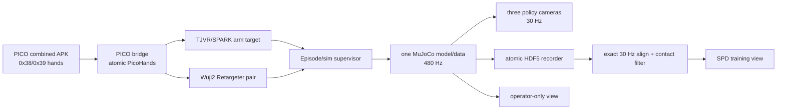

# SPD × Tianji-Wuji2 完整复现计划书

## 1. 项目结论

本项目当前建立的是 **`spd-vr` 仿真分支**：把论文本体替换为仓库中的 Tianji 双臂 + Wuji2 双手，并保留论文的仿真采集、任务覆盖和 30 Hz training-view 结构。真实 follower、Manus/其他硬件输入、厂家 safety 参数、硬件急停和真实微调全部后置到 `spd-teleop`。

必须区分两种目标：

1. **当前可执行目标**：在 54-DoF Tianji-Wuji2 目标本体上完成 PICO atomic hands、MuJoCo unified plant、六场景 procedural reset、VR episode recorder/replay 和 simulator pilot；
2. **后置研究目标**：完成真实遥操作、五任务微调、from-scratch BC、2×2 消融和 sim/real gate；这些不属于当前分支的实现或安全声明。

原论文使用每侧 6-DoF 手臂 + 22-DoF Sharpa 手，共 56 DoF；当前 URDF 是每侧 7-DoF Tianji + 20-DoF Wuji2，共 54 DoF。禁止 padding 到 56-D 或使用伪兼容。

论文没有公开的 SPD 源码、checkpoint、六场景资产和完整硬件参数继续按独立实现处理；当前实现的每一项本地设定都写入 episode manifest 和 source/config checksum。

---

## 2. 复现依据与证据边界

### 2.1 一手资料

- 本地论文：[2608.15917v1.pdf](./2608.15917v1.pdf)
- 官方项目页：[spd.bot](https://spd.bot/)
- 官方实验页：[spd.bot/#experiments](https://spd.bot/#experiments)
- arXiv 条目：[arXiv:2608.15917](https://arxiv.org/abs/2608.15917)
- 目标机器人：[assets/tianji_wuji2/tianji_wuji2.urdf](./assets/tianji_wuji2/tianji_wuji2.urdf)

### 2.2 论文没有公开、不得臆造的参数

以下信息不在 v1 论文和项目页中：

- 完整源码、依赖锁文件、训练硬件、训练吞吐和总训练时间；
- 六个场景的 MJCF、全部对象资产、精确质量/摩擦/接触参数及随机化范围；
- 相机精确外参、内参、曝光和真实图像原始分辨率；
- 关节 PD 增益、MuJoCo actuator 参数、自碰撞过滤表；
- Muon/AdamW 的全部次级参数、梯度裁剪、精度格式、分布式训练配置；
- checkpoint 选择规则、训练随机种子和任务初始位姿分布；
- 除 bottles 任务外其他真实评估任务的超时；
- 图像颜色、纹理增强的精确概率与范围。

处理原则：

1. 先请求或等待官方发布，并冻结下载资产的版本与校验和。
2. 官方资产仍不可得时，用本计划的标定流程确定本体相关参数。
3. 所有独立设定进入 `reproduction_manifest`，明确标为“论文未披露、本项目设定”。
4. 这些设定在正式评估前冻结，不允许根据最终成功率反向调参。

---

## 3. 论文协议基线

### 3.1 仿真数据采集

| 项目 | 论文协议 | 本项目要求 |
|---|---:|---:|
| 仿真器 | MuJoCo | MuJoCo，版本写入锁文件 |
| 物理步频 | 480 Hz | 480 Hz |
| 积分器 | `implicitfast` | 相同 |
| 摩擦锥 | elliptic | 相同 |
| no-slip iteration | 1 | 相同 |
| VR/控制/记录 | 60 Hz | 60 Hz hand/supervisor；200 Hz arm target；30 Hz camera/record |
| 头显 | Meta Quest 3 + WebXR | PICO 4 Ultra target + forthcoming combined APK；不得把 XRoboToolkit ingress 当作已冻结 |
| 操作者 | 5 人 | 5 人（正式 corpus 前置 readiness） |
| 采集期 | 1 周 | 75 h 仅在 sample/camera/PICO readiness 后启动 |
| 数据量 | 约 1,930 episodes / 75 h | pilot 先行；正式目标按 Table 2 |
| 训练采样率 | 30 Hz | 30 Hz exact grid |
| 渲染分辨率 | 224×168 | 三逻辑相机 `top/left_wrist/right_wrist`，RGB+segmentation |
| 相机 | 顶部 1 + 左右腕部各 1 | provisional-v1 YAML；PICO 头显流不入 policy dataset |
| 空闲裁剪 | 超过 10 s 无手-物接触的片段 | raw episode 保留，过滤审计另存 |
| 增强 | 对象随机染色、背景/桌面纹理替换、左右镜像 | 当前先冻结对象物理/颜色 manifest |

每个 task registry 条目必须包含自然语言提示、目标时长、reset 函数、对象资产抽样、初始位姿、物理参数和随机种子。自然语言提示只面向操作者，**不进入策略输入**。

三键脚踏板语义保持论文一致：checkpoint、pause、revert/skip。手与对象接触时禁止创建 checkpoint，确保 revert 总能回到无接触状态。

### 3.2 `spd-75h` 采集配额

以论文附录 Table 2 为采集配额，不用“凑够总小时数”替代任务覆盖：

| Scene | Task | Episodes | Minutes |
|---|---|---:|---:|
| Jenga | Hollow tower | 92 | 567 |
| Jenga | Tower | 87 | 473 |
| Jenga | Dominos | 107 | 471 |
| Jenga | Criss-cross | 103 | 386 |
| Jenga | Handover L→R | 96 | 172 |
| Jenga | Handover R→L | 72 | 109 |
| Spelling Blocks | Spelling | 168 | 587 |
| Spelling Blocks | Sort and unload | 25 | 144 |
| Spelling Blocks | Pyramid | 32 | 136 |
| Spelling Blocks | Sort vowels/consonants | 50 | 109 |
| Mugs | Hang mug | 406 | 491 |
| Dishes | Rack dishes | 129 | 285 |
| Dishes | Plate dishes | 79 | 109 |
| Cups | Pyramid | 44 | 109 |
| Cups | Stack two threes | 46 | 67 |
| Cups | Unstack | 30 | 47 |
| Bottles | Toss in bin | 350 | 253 |
| **论文报告总计** |  | **1,916** | **4,516** |

论文称原始数据约 1,930 episodes；表格省略了少于 10 episodes 的任务，因此表格总数为 1,916。本项目同时记录“原始 episode 数”和“过滤后训练 episode 数”，不混淆两种口径。

### 3.3 真实遥操作（`spd-teleop` 后置）

真实多进程 follower、Manus/其他硬件输入、真实相机、ZeroMQ hardware schema、厂家安全参数、硬件急停和真实微调不在当前 `spd-vr`。`spd-vr` 只保留 simulator/recorder contracts，使用 PICO atomic hands、accepted arm UDP v1 和 unified MuJoCo plant。后置分支必须另行完成真实 R1–R3 gate，不能把本段当作当前实现。

### 3.4 模型与训练

| 项目 | 论文值 | Tianji-Wuji2 适配 |
|---|---:|---:|
| 策略参数 | 222M | 主干保持；54-D 投影层导致总数有极小变化，记录精确值 |
| 冻结视觉编码器 | DINOv3 ViT-B/16，86M | 相同权重和校验和 |
| Action expert | 58M 独立权重 | 相同结构 |
| Transformer | 8 blocks | 相同 |
| Hidden size | 768 | 相同 |
| Attention heads | 12 | 相同 |
| MLP expansion | 4 | 相同 |
| 序列长度 | 256 steps @ 30 Hz | 相同，约 8.53 s |
| 滑窗 | 32 steps | 相同 |
| Action chunk | 8 steps | 相同，约 0.267 s |
| 图像间隔 | 每 8 steps | 相同 |
| 每相机视觉 queries | 4 | 相同；3 相机共 12 tokens/图像时刻 |
| Proprioception | 56-D normalized | **54-D normalized** |
| Previous action | 56-D normalized | **54-D normalized** |
| Flow path | `x_t=(1-t)x_0+t x_1` | 相同 |
| Flow target | `v=x_1-x_0` | 相同 |
| Flow time | `t ~ U[0,1]` | 相同 |
| Observation/action noise | Gaussian σ=0.03 | 相同，归一化空间 |
| Batch size | 64 | 相同 |
| Learning rate | 1×10⁻³ constant | 相同 |
| Weight decay | 0.1 | 相同 |
| Optimizer | Muon（矩阵）+ AdamW（其余） | 相同 |
| EMA half-life | 20 steps | 相同 |
| Pre-training | 170k steps | 相同 |
| Inference | 10 Euler flow steps | 相同 |

模型 token 顺序必须忠实实现：每个时间步含 proprioception token 和 previous-action token；每八个时间步增加三路相机各 4 个 pooled visual tokens，并构造 8-step noised action chunk。视觉 pooled tokens 每隔两个 trunk block 经相机专属 cross-attention 重新读取原始 ViT patch bank。全部注意力因果化；时间戳使用 RoPE；chunk 内位置和 flow time 使用各自绝对 embedding。

训练时在因果 mask 下并行去噪一个 256-step 序列中的全部 chunks。部署时使用与 32-step 训练滑窗一致的 rolling KV cache；不增加论文未描述的 temporal ensembling、语言条件或额外状态输入。

真实微调为全策略微调；DINOv3 仍按架构保持冻结，不使用 LoRA 或 adapter。

### 3.5 真实微调配额

| Task | Training steps | Minutes | Episodes |
|---|---:|---:|---:|
| Bottles in bin | 6k | 72 | 270 |
| Plate racking | 6k | 70 | 161 |
| Cup stacking | 10k | 121 | 217 |
| Jenga playing | 6k | 48 | 193 |
| Mug hanging | 6k | 44 | 238 |

每个任务建立两条训练分支：

- **SPD, pre-trained**：从 170k 仿真预训练 checkpoint 开始，使用该任务全部真实示范微调。
- **BC, from-scratch**：完全相同架构、真实数据、训练步数、batch 采样和评估协议，随机初始化后训练。

任何只对其中一条分支有利的数据过滤、checkpoint 选择或训练重启均禁止。

### 3.6 正式评价规则

每个 checkpoint、每个任务做 20 次真实机器人 trial；初始对象位姿按预先冻结的 seed manifest 随机化。每次 trial 仅取达到的最高阶段分数，除以任务最大分数后得到 progress。

| Task | Setting | Max | 评分规则 |
|---|---|---:|---|
| Bottles in bin | 4 bottles + 1 bin | 4 | 每个投入箱中的瓶子 +1；60 s 超时 |
| Plate racking | 2 plates + 1 rack | 4 | 每个拿起的盘子 +1；每个放入架子的盘子再 +1 |
| Cup stacking | 6 cups | 8 | 每个正确放置的杯子 +1；每个后续 destack 动作 +1 |
| Jenga playing | 1 tower | 3 | 推出中间积木 +1；从另一侧拉出且塔不倒 +1；放到顶部 +1 |
| Mug hanging | 1 mug + 1 mug tree | 3 | 拿起 +1；双手交接 +1；挂上 hook +1 |

主报告必须展示：

- 每任务 20 trials 的逐次原始评分；
- normalized mean progress 和 standard error；
- 每个阶段的累计到达率；
- SPD 与 from-scratch 的训练 loss 曲线；
- 五任务 macro average；
- 所有失败视频及失败分类，不只展示成功 rollout。

盲评要求：trial 视频先去除模型标签，由两名评分者独立打分；分歧回看裁决。硬件故障、人工触发急停和任务本身失败必须使用预先定义的判定规则，不能在看见结果后选择是否重试。

---

## 4. Tianji-Wuji2 本体审计与必要改造

### 4.1 已确认的 URDF 事实

对当前 URDF 的完整 XML 审计结果：

- 80 links、79 joints，构成单棵树；
- 54 个 revolute joints、25 个 fixed joints；
- 左右各 27 个可动关节：7 arm + 20 hand；
- 全部 65 个唯一 mesh 引用均存在；
- 总标称质量约 104.4332 kg；
- 无 `<transmission>`；54 个可动关节均无 `<dynamics>`；
- URDF 中没有 camera link 或 camera optical frame；
- `TCP_Link_L`、`TCP_Link_R` 的质量为 0.05 kg，但惯量矩阵全零，不是正定刚体惯量；
- 大多数 collision 直接复用高精度 STL visual mesh；
- arm effort 范围 18–108，速度上限均为 3.1416 rad/s；hand effort 范围 0.2–2.0，速度上限 8.11–13.5 rad/s。

结论：该 URDF 足够作为几何/运动学来源，但**不能直接作为接触仿真和控制模型投入 75 小时采集**。

### 4.2 54-D 动作合同

固定关节顺序，训练、仿真、遥操作、真实驱动和日志必须共享同一份 machine-readable joint manifest：

1. `Joint1_L ... Joint7_L`；
2. 左手 20 joints，按 thumb→index→middle→ring→pinky、近端→远端固定；
3. `Joint1_R ... Joint7_R`；
4. 右手 20 joints，顺序与左手镜像一致。

策略只读取 54-D `qpos`，只输出 54-D 关节位置命令。速度、电流、温度、接触和 IK 诊断可以记录，但不加入论文主模型输入。

禁止把 54-D padding 到 56-D。若未来获得原论文 56-D checkpoint，可复用视觉主干和兼容的 Transformer block；54-D modality projection 必须重新初始化并训练。原 checkpoint 只能作为额外迁移实验，不能替代本体内 75 小时预训练主实验。

### 4.3 Unified MJCF 与 manifest

`PICO_tracker/src/spd_vr/spd_vr/model_builder.py` 以 Tianji `marvin_m6_qp_pico_fast.xml` 为 arm base，读取 URDF 中 `JointMarker_*`、marker links、`JointWuji2_*` 的 fixed transforms，将官方 Hand2 左右 MJCF 接到 `Link7_L/Link7_R`。生成：

- `src/spd_vr/generated/tianji_wuji2_spd.xml`：54 hinge joints + 54 position actuators；
- `src/spd_vr/generated/joint_manifest.yaml`：left arm7 → left hand20 → right arm7 → right hand20，逐名保存 qpos/dof/actuator address、range、velocity/effort；
- `src/spd_vr/generated/sim_actuator_calibration.yaml`：arm `[25,50,100,200,400]`、hand `[1,2,4,8,16]` 候选，`kd=2*sqrt(kp*M_ii(home))`，显式 step-response gate；
- source MJCF/URDF/mesh SHA-256。

生成器拒绝 duplicate/missing names；`manifest.py` 启动时逐名解析 MuJoCo address，任何 set、order 或 actuator mapping 不一致均失败。原始 URDF 不原地修改。

---

## 5. 系统设计

### 5.1 Unified `spd-vr` topology

当前分支复用的合同：

- 54-D manifest：left arm7 → left hand20 → right arm7 → right hand20；
- `top`、`left_wrist`、`right_wrist` 三个 camera keys；
- PICO raw hands `float32[N,26,7]` 与 active/scale/epoch/sequence；
- 60 Hz robot/action raw stream，200 Hz accepted arm target，480 Hz physics；
- 30 Hz image alignment 只取过去最近帧，age ≤50 ms；
- 无 follower、真实电流/温度、厂商 SDK 或硬件急停字段。

### 5.2 PICO retarget 与 arm target

arm：保留现有 TJVR v4 PICO body/wrist input和 `spark_upper_qpoases_headroom_feedforward_velocity_qp` 200 Hz velocity/model-reference controller。`arm_target_protocol.*` 在 `robot.setArmState(...)` 后发送 272-byte little-endian `SPDA` packet；stale/failure/paused 发送最后安全 q/qdot 并清除对应 valid bit。

hand：`PicoHandsInput` 固定 PICO 26→MediaPipe 21 索引 `[1,2,3,4,5,7,8,9,10,12,13,14,15,17,18,19,20,22,23,24,25]`，复用 `apply_mediapipe_transformations()`，不重复旋转。左右 `Retargeter` 同时消费一个原子 frame；inactive 侧单独 HOLD，另一侧继续。Hand2 URDF/Pinocchio 输出严格重排至官方 MJCF actuator order，缺失 mapping 直接失败。

### 5.3 三相机对齐

- logical names fixed: `top`, `left_wrist`, `right_wrist`;
- all frames validated as RGB `uint8[168,224,3]` and segmentation `int32[168,224,2]`;
- provisional config uses fovy 70°, near 0.01 m, far 3.0 m, revision `provisional-v1`;
- extrinsics come from `config/sim_cameras.yaml`: top world `[0.50,0,1.80]→[0.45,0,1.05]`, left wrist `[-.035,0,.005]→[0,0,-.150]`, right wrist `[.035,0,.005]→[0,0,-.150]`;
- render runs at 30 Hz without blocking physics; timestamp rollback, missing/duplicate names or shape/dtype mismatch aborts the episode;
- operator PICO stereo is isolated in `OperatorViewProvider`, with motion-to-photon P95 <120 ms readiness gate.

### 5.4 物理与控制标定

按顺序标定，禁止把所有误差混成隐藏常量：

1. **运动学/装配**：从 URDF fixed transforms 接入 TCP→marker→Hand2 mount，保持 URDF 原文件不变；
2. **position actuator**：arm candidates `[25,50,100,200,400]`、hand candidates `[1,2,4,8,16]`，每 joint 按 `kd=2*sqrt(kp*M_ii(home))` 运行 deterministic step-response gate；
3. **边界**：manifest ranges、velocity/effort limits、finite/epoch/sequence/freshness 检查，不通过即侧别 HOLD；
4. **接触**：box/cylinder/capsule procedural geoms，初始 `mj_forward` contact gate，最多 32 个同 seed candidate；
5. **数据**：将 sampled mass/friction/color/pose、code/config/model/sample checksum 写入 manifest。

没有通过候选的 joint 使 model build 失败；不手调隐藏 kp。真实 payload/硬件标定仅在 `spd-teleop`。

### 5.5 数据格式与可重放性

每个 raw episode 至少保存：

- `episode_id`、scene、task、prompt、seed、完整 reset sampled values；
- `observations/qpos[54]`、`observations/qvel[54]`、`actions/qpos_target[54]`；
- 三路 RGB/segmentation、每路原始 camera timestamp 和 calibration revision；
- PICO raw hands `float32[N,26,7]`、active/scale/epoch/sequence；
- arm/hand validity、objects state、contacts、checkpoint/state epoch；
- code/config/model/sample SHA-256 和所有原始 timestamp。

写入 staging 后只在 dataset lengths/checksums 全部通过时 `os.replace` 发布。30 Hz view 从 60 Hz raw robot/action 偶数 sequence 取样；图像仅选过去最近帧且 age ≤50 ms。播放器只读取仿真字段，不定义真实硬件字段。

### 5.6 视觉与对称增强

- 使用 instance mask 随机改变对象颜色；机器人本体颜色不进入对象 tint。
- 随机替换背景和桌面纹理；保留接触几何不变。
- 左右对称增强同时执行：交换左右手臂状态和动作、按经过 FK 验证的 sign/permutation 映射变换关节、交换左右腕相机、水平翻转对应图像、水平翻转顶部图像。
- 增强必须在 dataloader 后以 GPU transform 执行，不保存成重复数据副本。
- 对称增强单测必须证明：镜像两次恢复原样；镜像后的 FK、tip 和对象语义与世界反射一致。

---

## 6. 分阶段执行计划与退出门禁

### Phase 0：资产冻结与复现清单

工作：

- 固化论文 v1、项目页、网页绘图 JS 中的实验数值和本 URDF 校验和。
- 联系作者获取 `spd-vr`、`spd-75h`、六场景、训练代码、checkpoint 和许可证。
- 建立“论文公开值 / 官方实现值 / 本项目值”三列表；官方实现与论文冲突时保留两者并说明主实验采用哪一个。
- 锁定 MuJoCo、PICO bridge/arm protocol、Wuji retarget、Muon/AdamW 和训练框架版本；当前不锁定 forthcoming APK binary。

退出门禁：每个未公开参数都有来源、测量方案或冻结规则；不存在无归属的默认值。

### Phase 1：机器人数字孪生

工作：

- 建 joint manifest、frame manifest、URDF→MJCF 编译器。
- 修正 TCP 零惯量、collision mesh、self-collision、actuator 和 3 个相机。
- 完成 FK、joint direction、mesh unit、质量和 workspace 对照。
- 建 sim/real calibration 数据集和回放工具。

退出门禁：通过第 4.4 节全部运动学与稳定性测试；模型可连续运行 30 min 无发散。

### Phase 2：VR 遥操作最小闭环

工作：

- mock 或 forthcoming combined PICO APK 发送现有 14-byte TCP frame 与 `0x38/0x39` atomic hands；PICO bridge 只发布 immutable `/pico/hands`；
- 现有 TJVR/SPARK accepted arm target 与官方 Hand2 `Retargeter` pair 进入统一 supervisor；
- 以 480/200/60/30 Hz 分层运行仿真、arm target、hand/supervisor、camera/record；测试 pause、checkpoint、revert/skip；
- `OperatorViewProvider` 与 policy cameras 分离；头显显示不写入训练数据。

退出门禁：5 名操作者均能完成抓取、双手交接、堆叠和插放的 pilot；达到 retarget 误差门槛；无未处理 tracking loss。

### Phase 3：六场景与接触标定

工作：

- 建 Jenga、Spelling Blocks、Mugs、Dishes、Cups、Bottles 六场景。
- 为每个 task 实现 prompt、duration、reset、资产/位姿/物理随机化和完整日志。
- 使用多个对象实例；预训练对象与真实评估对象保持“同类但非同一实例”。
- 标定物体质量、尺寸、摩擦和接触响应；建立快速 reset。

退出门禁：每任务至少 10 个 pilot episodes 可重放；操作者不需要利用明显的仿真漏洞完成任务；接触失败已分类并修复。

### Phase 4：数据与模型管线试运行

工作：

- 每场景采集 30–60 min pilot 数据。
- 执行无接触 >10 s 裁剪、30 Hz 重采样、224×168 三视图渲染、segmentation 和 GPU 增强。
- 验证 54-D normalization 统计只来自训练集。
- 实现 8-block causal diffusion Transformer、prefix-parallel 去噪和 rolling KV cache。
- 完成单 batch overfit、无未来信息泄漏、完整 attention 与 rolling cache 等价性测试。

退出门禁：

- 数据无 NaN、时间倒退、维度错位和未来帧泄漏；
- rolling cache 与同窗口完整前向在相同输入上最大绝对误差 ≤1e-4（允许的低精度误差需单独记录）；
- 100 个连续异步推理 tick 无 cache 漂移，推理不阻塞 30 Hz 控制循环；
- pilot 模型能在仿真回放中输出平滑、限位内的 54-D action。

### Phase 5：完整 75 小时仿真采集

工作：

- 5 名操作者按第 3.2 节配额并行采集一周。
- 每日只做数据完整性、设备状态和任务配额检查；不根据模型效果改变任务定义。
- 过滤无效片段并保留审计记录；任务少于 10 episodes 的长尾可保留在 raw set，但按论文表格口径单独报告。
- 生成不可变 dataset manifest、train shard 和 checksums。

退出门禁：过滤后接触有效时长不低于 75 h；六场景和目标任务配额达标；所有样本有三视图、54-D 状态/动作、时间戳和版本元数据。

### Phase 6：仿真预训练

工作：

- 以 batch 64、LR 1e-3 constant、weight decay 0.1、Muon+AdamW、170k steps 训练。
- DINOv3 ViT-B/16 冻结；EMA half-life 20 steps。
- 每次 run 保存配置、代码/数据/权重 checksum、loss、吞吐、显存、随机种子和 checkpoint。
- 训练前做 100-step 性能基准，据实决定分布式策略；不改变全局 batch 或 update 数来迁就硬件。

退出门禁：170k steps 无数值异常；最终与 EMA checkpoint 均可恢复；固定样本上的 action-flow 输出可重复；训练 loss 和样本可视化通过审计。

### Phase 7：真实机器人遥操作与安全（`spd-teleop` 后置）

本分支不实现 ZeroMQ hardware process、Tianji/Wuji2 follower、Manus/硬件输入、真实 D405、厂家 safety 参数或硬件急停。`spd-teleop` 需另行建立这些组件并通过独立 R1–R3 安全评审；不得以 `spd-vr` 的仿真结果替代实机安全证据。

### Phase 8：真实示范采集与微调

工作：

- 按 Table 5 精确采集五任务 episodes/minutes；每个任务使用与仿真同类但非同一对象实例。
- 冻结每任务数据 manifest；SPD 与 scratch 分支共享完全相同的数据顺序策略。
- 按论文步数全量微调；保存训练 loss 和最终 checkpoint。
- checkpoint 选择在官方规则缺失时固定为最终训练步，且两分支一致；若官方实现发布则统一迁移到官方规则并重跑两分支。

退出门禁：五任务配额、训练步数和两分支公平性审计全部通过。

### Phase 9：主实验与 2×2 消融

主实验：

- `w=32, c=8` 的 SPD 与 from-scratch 各做五任务×20 trials。
- 固定对象集合、初始位姿 seed、相机参数、评分员和 checkpoint 规则。

消融实验：

- `w∈{1,32}` × `c∈{8,32}`；
- 四种架构分别从 SPD checkpoint 和 scratch 训练，共 8 个条件；
- 共享架构其他参数、真实微调数据和训练时长；
- 每条件均按同一五任务协议评价。

退出门禁：全部 trial 有原始日志、视频、评分和故障判定；没有选择性删除或补跑。

### Phase 10：统计、复现包与结项

工作：

- 生成论文同构的阶段累计图、平均 progress、SE、loss 曲线和消融雷达图。
- 输出本体差异、公开参数、独立设定和偏差分析。
- 发布可重建环境、代码、配置、scene manifest、dataset manifest、模型权重、trial seeds、原始评分和失败视频；受许可证限制的资产只发布获取脚本和 checksum。
- 在新的干净机器上从 manifest 重跑：模型构建、一个训练 step、一个离线推理和一个仿真 rollout。

退出门禁：第三方仅依赖发布说明即可复现一个完整最小路径；正式结果表可从原始 trial 日志自动生成。

---

## 7. 成功标准

### 7.1 方法忠实度：硬门槛

以下任一项不满足，不得称为 SPD 完整复现：

- 六场景、约 75 h、五操作者、目标本体内仿真遥操作；
- 三视图、256-step history、DINOv3 ViT-B/16、8-block/768/12-head trunk；
- causal prefix-parallel flow matching、32-step sliding window、8-step chunk；
- 170k 仿真预训练、每任务完整真实微调；
- 相同真实数据上的 from-scratch BC；
- 五任务、每 checkpoint 每任务 20 trials、论文评分 rubric；
- `w×c` 2×2 消融在 pre-trained/scratch 两种训练 regime 下完整执行。

### 7.2 科学结论复现：主判据

预先注册如下判据：

1. 五任务 macro-average 上，SPD 相对 from-scratch 的 progress 差值为正，bootstrap 95% CI 不跨 0。
2. 五个任务的 point estimate 均不低于 from-scratch；若单任务下降，必须报告，不能只报告 macro-average。
3. `w=32,c=8` 是两个训练 regime 中的最佳或并列最佳 macro-average 配置。
4. `w=1,c=8` 显著表现出短 chunk 且无历史造成的不稳定/低进度；加入历史后性能恢复。

论文网页给出的参考目标不是 Tianji-Wuji2 的硬阈值，但用于偏差分析：

| Task | SPD (%) | Scratch (%) | 论文差值 (pp) |
|---|---:|---:|---:|
| Plates | 80.625 | 66.875 | 13.750 |
| Cups | 55.625 | 35.000 | 20.625 |
| Jenga | 85.000 | 65.000 | 20.000 |
| Mugs | 93.333 | 80.000 | 13.333 |
| Bottles | 68.750 | 47.500 | 21.250 |
| **Macro average** | **76.667** | **58.875** | **17.792** |

若 Tianji-Wuji2 达到同方向但绝对值不同，结论是“跨本体方法复现成功”；只有使用原论文硬件、对象、场景、数据和代码时，才讨论“原数值复现”。

### 7.3 论文消融参考值

顺序均为 Plates / Mugs / Jenga / Cups / Bottles：

| Regime | w | c | 论文 progress (%) |
|---|---:|---:|---|
| SPD | 1 | 8 | 31.9 / 35.0 / 0.0 / 0.0 / 0.0 |
| SPD | 1 | 32 | 55.6 / 58.3 / 5.0 / 15.0 / 36.2 |
| SPD | 32 | 32 | 44.4 / 78.3 / 16.7 / 36.9 / 70.0 |
| SPD | 32 | 8 | 80.6 / 93.3 / 85.0 / 55.6 / 68.8 |
| Scratch | 1 | 8 | 16.2 / 38.3 / 0.0 / 0.0 / 0.0 |
| Scratch | 1 | 32 | 36.9 / 60.0 / 18.3 / 17.5 / 33.8 |
| Scratch | 32 | 32 | 41.9 / 70.0 / 30.0 / 41.2 / 51.2 |
| Scratch | 32 | 8 | 66.9 / 80.0 / 65.0 / 35.0 / 47.5 |

---

## 8. 风险登记与应对

| 风险 | 证据/影响 | 决策与门禁 |
|---|---|---|
| 官方资产尚未公开 | 无法代码级逐项对齐 | Phase 0 请求资产；独立实现全部标记来源；发布后先审计再切换 |
| 56→54 DoF 本体差异 | 原 checkpoint 的动作头不兼容，动态行为不可直接比较 | 主实验在 54-D 本体内从头采集和预训练；不 padding |
| URDF 不能直接做接触仿真 | 零惯量 TCP、无 actuator/dynamics、复杂 STL collision | 生成 unified MJCF；procedural contact geoms、manifest 和 calibration gate 后才采数据 |
| 无策略 camera frame | 视觉数据合同无法验证 | 三 logical cameras + provisional YAML；缺帧/shape/rollback 立即使 episode 失败 |
| 接触参数失真 | 操作者可能学到仿真漏洞 | deterministic primitive assets、contact gate、过滤审计；正式采集前冻结 |
| Wuji2 手指与 PICO 映射误差 | pinch/交接失败 | fixed 26→21 adapter、官方 Hand2 retarget、inactive 单侧 HOLD；样本通过前只做 pilot |
| 真实硬件风险 | 当前 branch 没有 real follower/safety | 全部迁移到 `spd-teleop`，不得在 `spd-vr` 伪造 backend 或安全认证 |
| 训练算力未知 | 论文未给训练硬件/时长 | 100-step 基准后配置集群；保持 batch 64 和 170k updates |
| 存储量未知 | JPEG、mask、状态和原始流可能远超预估 | pilot 实测每分钟体积，按 75 h 投影并至少保留 2×容量 |
| 评价偏差 | 阶段评分和补跑可人为影响结论 | 固定 seed、盲评、双评分员、预注册硬件故障规则 |
| checkpoint cherry-pick | 论文未披露选择规则 | 默认最终 step，两分支相同；官方规则发布后同步重跑 |
| 安全事故 | 双臂双手接触任务风险高 | 分级解锁、急停、watchdog、工作空间笼、速度/温度/碰撞限制 |

---

## 9. 人员、设备与算力

### 9.1 当前 `spd-vr` 最小团队

- 1 名仿真/控制负责人：unified MJCF、PICO protocol、Wuji retarget、scene/contact；
- 1 名数据负责人：HDF5 recorder、align/filter/replay、checksums；
- 1 名 VR/operator 负责人：forthcoming APK wire contract、OperatorViewProvider、readiness；
- 5 名经过统一培训的仿真操作者（正式 corpus 前置）。

### 9.2 当前必备资产

- PICO 4 Ultra 与 forthcoming combined APK（未交付前使用 mock server）；
- 已固定的 Wuji description/MuJoCo submodules、Tianji URDF/MJCF 和 Pixi lockfiles；
- 可运行 MuJoCo 480 Hz、三路 224×168 render 和 atomic HDF5 的主机；
- `data/pico_hand_samples/raw/pico_hands_60s.npz` 到位前只允许 synthetic/pilot；
- 真实双臂/双手、厂家 SDK、D405、硬件急停和安全设备仅为 `spd-teleop` 后置前置条件。

---

## 10. 建议日程

以当前 submodule/lockfile 基线为起点，按 readiness 而非日期推进：

| 阶段 | 主要工作 |
|---|---|
| 现在 | `spd-vr` PICO wire、sample schema、Wuji retarget、arm UDP v1 |
| 现在 | unified 54-DoF model/manifest/calibration、three-camera API |
| 现在 | six procedural scenes、episode state machine、HDF5/replay |
| pilot | mock/scene/camera/physics benchmark，校验 recording/replay |
| 后置 | `spd-teleop` hardware follower、真实输入、安全和 sim/real gate |
| 后置 | 75 h formal corpus、预训练、真实微调、BC 和消融 |

任一当前 readiness gate 失败都返回对应实现修复；样本或 camera revision 未冻结前不开始正式 75 h。

---

## 11. 最终交付清单

1. 原始 URDF 不变；生成并校验 `tianji_wuji2_spd.xml`、54-joint manifest、camera YAML 和 actuator calibration。
2. `spd-vr`：PICO 14-byte bridge、0x38/0x39 atomic `PicoHands`、mock cases、optical palm publisher。
3. `spd_vr` 26→21 adapter、官方 Hand2 左右 retarget、strict mapping 和单侧 HOLD。
4. Tianji accepted model-reference 的 272-byte arm UDP v1、Python decoder、C++/Python fixture。
5. 六场景 procedural assets、17-task registry、seed/sample manifest、contact gate、episode state machine。
6. raw/filtered/replay 数据合同：atomic staging HDF5、30 Hz exact alignment、segmentation、checksums。
7. Pixi lock/build/test 选择、启动/停止脚本、实现基线文档和 APK contract。
8. `spd-teleop` 的真实 follower、硬件 SDK、安全、五任务微调和正式实验作为独立后置交付，不计入当前 branch readiness。

当前可标记为“SPD VR simulation implementation ready”的条件是本计划的 mock、model、scene、camera、record/replay gate 全部通过；不能据此宣称真实机器人安全或论文数值逐点复现。
