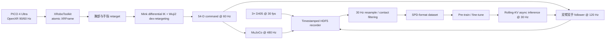

# SPD × Tianji-Wuji2 完整复现计划书

## 1. 项目结论

本项目复现论文 **Pre-training Visual Dexterity in Simulation（SPD）** 的完整科学方案，但把原论文的 YAM Pro + Sharpa Wave 双臂双手替换为仓库中的 Tianji 双臂 + Wuji2 双手。

必须区分两种目标：

1. **方法级忠实复现（本项目主目标）**：在 Tianji-Wuji2 的目标本体上重新建设仿真、VR 遥操作、75 小时预训练数据、222M 因果扩散 Transformer、真实遥操作、五任务微调、从零 BC 对照和 2×2 消融。除本体维度外，论文公开的协议全部保持一致。
2. **原论文数值逐点复现（不能由当前机器人保证）**：原论文使用每侧 6-DoF 手臂 + 22-DoF Sharpa 手，共 56 DoF；当前 URDF 是每侧 7-DoF Tianji 手臂 + 20-DoF Wuji2 手，共 54 DoF。不同本体、接触几何和执行器意味着不能把论文的成功率逐点相等作为合理验收条件。

因此，“完美复现”定义为：**实验因果结构、数据规模、模型结构、训练协议、对照组、消融组、评价规则和统计口径全部复现；本体相关输入输出仅做必要的 56→54 维干净替换，不做补零或伪兼容。**

截至计划编写时，论文声称将发布 `spd-vr`、`spd-75h` 和六个场景，但项目页只提供论文入口，未提供代码、数据集、场景或 checkpoint 下载链接。因此当前只能按论文独立重建；一旦官方资产发布，必须先做差异审计，再决定替换独立实现，不能混用而不记录。
实际平台配置、坐标合同、频率、安全门禁和实施顺序见 [SPD_PICO_XROBOT_TIANJI_WUJI2_SETTING.md](./SPD_PICO_XROBOT_TIANJI_WUJI2_SETTING.md)；该 Setting 是本计划的平台实现基线。

---

## 2. 复现依据与证据边界

### 2.1 一手资料

- 本地论文：[2608.15917v1.pdf](./2608.15917v1.pdf)
- 官方项目页：[spd.bot](https://spd.bot/)
- 官方实验页：[spd.bot/#experiments](https://spd.bot/#experiments)
- arXiv 条目：[arXiv:2608.15917](https://arxiv.org/abs/2608.15917)
- 目标机器人：[assets/tianji_wuji2/tianji_wuji2.urdf](./assets/tianji_wuji2/tianji_wuji2.urdf)

### 2.2 论文没有公开、不得臆造的参数

以下信息不在 v1 论文和项目页中：

- 完整源码、依赖锁文件、训练硬件、训练吞吐和总训练时间；
- 六个场景的 MJCF、全部对象资产、精确质量/摩擦/接触参数及随机化范围；
- 相机精确外参、内参、曝光和真实图像原始分辨率；
- 关节 PD 增益、MuJoCo actuator 参数、自碰撞过滤表；
- Muon/AdamW 的全部次级参数、梯度裁剪、精度格式、分布式训练配置；
- checkpoint 选择规则、训练随机种子和任务初始位姿分布；
- 除 bottles 任务外其他真实评估任务的超时；
- 图像颜色、纹理增强的精确概率与范围。

处理原则：

1. 先请求或等待官方发布，并冻结下载资产的版本与校验和。
2. 官方资产仍不可得时，用本计划的标定流程确定本体相关参数。
3. 所有独立设定进入 `reproduction_manifest`，明确标为“论文未披露、本项目设定”。
4. 这些设定在正式评估前冻结，不允许根据最终成功率反向调参。

---

## 3. 论文协议基线

### 3.1 仿真数据采集

| 项目 | 论文协议 | 本项目要求 |
|---|---:|---:|
| 仿真器 | MuJoCo | MuJoCo，版本写入锁文件 |
| 物理步频 | 480 Hz | 480 Hz |
| 积分器 | `implicitfast` | 相同 |
| 摩擦锥 | elliptic | 相同 |
| no-slip iteration | 1 | 相同 |
| VR/控制/记录 | 60 Hz | 60 Hz |
| 头显 | Meta Quest 3 + WebXR | **PICO 4 Ultra + XRoboToolkit/OpenXR**；90 Hz XR 帧、60 Hz hand joints |
| 操作者 | 5 人 | 5 人 |
| 采集期 | 1 周 | 全量采集连续 1 周窗口 |
| 数据量 | 约 1,930 episodes / 75 h | 不低于 75 h 接触有效片段 |
| 训练采样率 | 30 Hz | 30 Hz |
| 渲染分辨率 | 224×168 | 相同 |
| 相机 | 顶部 1 + 左右腕部各 1 | 相同布局，仿真/真实共用标定定义 |
| 空闲裁剪 | 超过 10 s 无手-物接触的片段 | 相同 |
| 增强 | 对象随机染色、背景/桌面纹理替换、左右镜像 | 相同语义 |

每个 task registry 条目必须包含自然语言提示、目标时长、reset 函数、对象资产抽样、初始位姿、物理参数和随机种子。自然语言提示只面向操作者，**不进入策略输入**。

三键脚踏板语义保持论文一致：checkpoint、pause、revert/skip。手与对象接触时禁止创建 checkpoint，确保 revert 总能回到无接触状态。

### 3.2 `spd-75h` 采集配额

以论文附录 Table 2 为采集配额，不用“凑够总小时数”替代任务覆盖：

| Scene | Task | Episodes | Minutes |
|---|---|---:|---:|
| Jenga | Hollow tower | 92 | 567 |
| Jenga | Tower | 87 | 473 |
| Jenga | Dominos | 107 | 471 |
| Jenga | Criss-cross | 103 | 386 |
| Jenga | Handover L→R | 96 | 172 |
| Jenga | Handover R→L | 72 | 109 |
| Spelling Blocks | Spelling | 168 | 587 |
| Spelling Blocks | Sort and unload | 25 | 144 |
| Spelling Blocks | Pyramid | 32 | 136 |
| Spelling Blocks | Sort vowels/consonants | 50 | 109 |
| Mugs | Hang mug | 406 | 491 |
| Dishes | Rack dishes | 129 | 285 |
| Dishes | Plate dishes | 79 | 109 |
| Cups | Pyramid | 44 | 109 |
| Cups | Stack two threes | 46 | 67 |
| Cups | Unstack | 30 | 47 |
| Bottles | Toss in bin | 350 | 253 |
| **论文报告总计** |  | **1,916** | **4,516** |

论文称原始数据约 1,930 episodes；表格省略了少于 10 episodes 的任务，因此表格总数为 1,916。本项目同时记录“原始 episode 数”和“过滤后训练 episode 数”，不混淆两种口径。

### 3.3 真实遥操作与记录

- 架构：每个手臂、手、相机和逻辑组件一个单用途进程；ZeroMQ PUB/SUB，经本机 IPC；消息为 JSON header + 原始数组字节。
- leader 命令：60 Hz。
- 手臂/手 follower：120 Hz。
- 相机：30 fps。
- 腕部：PICO optical wrist/palm tracking 60 Hz；接合时锚定操作者腕姿和机器人 TCP 姿态，后续应用相对位姿增量；旋转增量重新表达在末端坐标系。
- 手臂 IK：Mink 微分 IK，每 tick 4 次 QP；包括姿态、关节限位和速度任务；独立进程；指数平滑；目标跳变超过 8 cm 时插值。
- 手指：PICO 每手 26 个 OpenXR hand joints；转换到掌心坐标系后，通过 Wuji2 专属 `dex-retargeting` 优化映射到每手 20 个 joints。
- 手臂控制：关节位置 PD + 基于包含手部 payload 的 MuJoCo 逆动力学重力补偿。
- 手部控制：经厂商 SDK 的位置控制。
- 记录：每 stream 独立 HDF5 和并行时间戳；相机 JPEG 原始频率、手臂观测 120 Hz、命令 60 Hz；离线重采样到 30 Hz。

### 3.4 模型与训练

| 项目 | 论文值 | Tianji-Wuji2 适配 |
|---|---:|---:|
| 策略参数 | 222M | 主干保持；54-D 投影层导致总数有极小变化，记录精确值 |
| 冻结视觉编码器 | DINOv3 ViT-B/16，86M | 相同权重和校验和 |
| Action expert | 58M 独立权重 | 相同结构 |
| Transformer | 8 blocks | 相同 |
| Hidden size | 768 | 相同 |
| Attention heads | 12 | 相同 |
| MLP expansion | 4 | 相同 |
| 序列长度 | 256 steps @ 30 Hz | 相同，约 8.53 s |
| 滑窗 | 32 steps | 相同 |
| Action chunk | 8 steps | 相同，约 0.267 s |
| 图像间隔 | 每 8 steps | 相同 |
| 每相机视觉 queries | 4 | 相同；3 相机共 12 tokens/图像时刻 |
| Proprioception | 56-D normalized | **54-D normalized** |
| Previous action | 56-D normalized | **54-D normalized** |
| Flow path | `x_t=(1-t)x_0+t x_1` | 相同 |
| Flow target | `v=x_1-x_0` | 相同 |
| Flow time | `t ~ U[0,1]` | 相同 |
| Observation/action noise | Gaussian σ=0.03 | 相同，归一化空间 |
| Batch size | 64 | 相同 |
| Learning rate | 1×10⁻³ constant | 相同 |
| Weight decay | 0.1 | 相同 |
| Optimizer | Muon（矩阵）+ AdamW（其余） | 相同 |
| EMA half-life | 20 steps | 相同 |
| Pre-training | 170k steps | 相同 |
| Inference | 10 Euler flow steps | 相同 |

模型 token 顺序必须忠实实现：每个时间步含 proprioception token 和 previous-action token；每八个时间步增加三路相机各 4 个 pooled visual tokens，并构造 8-step noised action chunk。视觉 pooled tokens 每隔两个 trunk block 经相机专属 cross-attention 重新读取原始 ViT patch bank。全部注意力因果化；时间戳使用 RoPE；chunk 内位置和 flow time 使用各自绝对 embedding。

训练时在因果 mask 下并行去噪一个 256-step 序列中的全部 chunks。部署时使用与 32-step 训练滑窗一致的 rolling KV cache；不增加论文未描述的 temporal ensembling、语言条件或额外状态输入。

真实微调为全策略微调；DINOv3 仍按架构保持冻结，不使用 LoRA 或 adapter。

### 3.5 真实微调配额

| Task | Training steps | Minutes | Episodes |
|---|---:|---:|---:|
| Bottles in bin | 6k | 72 | 270 |
| Plate racking | 6k | 70 | 161 |
| Cup stacking | 10k | 121 | 217 |
| Jenga playing | 6k | 48 | 193 |
| Mug hanging | 6k | 44 | 238 |

每个任务建立两条训练分支：

- **SPD, pre-trained**：从 170k 仿真预训练 checkpoint 开始，使用该任务全部真实示范微调。
- **BC, from-scratch**：完全相同架构、真实数据、训练步数、batch 采样和评估协议，随机初始化后训练。

任何只对其中一条分支有利的数据过滤、checkpoint 选择或训练重启均禁止。

### 3.6 正式评价规则

每个 checkpoint、每个任务做 20 次真实机器人 trial；初始对象位姿按预先冻结的 seed manifest 随机化。每次 trial 仅取达到的最高阶段分数，除以任务最大分数后得到 progress。

| Task | Setting | Max | 评分规则 |
|---|---|---:|---|
| Bottles in bin | 4 bottles + 1 bin | 4 | 每个投入箱中的瓶子 +1；60 s 超时 |
| Plate racking | 2 plates + 1 rack | 4 | 每个拿起的盘子 +1；每个放入架子的盘子再 +1 |
| Cup stacking | 6 cups | 8 | 每个正确放置的杯子 +1；每个后续 destack 动作 +1 |
| Jenga playing | 1 tower | 3 | 推出中间积木 +1；从另一侧拉出且塔不倒 +1；放到顶部 +1 |
| Mug hanging | 1 mug + 1 mug tree | 3 | 拿起 +1；双手交接 +1；挂上 hook +1 |

主报告必须展示：

- 每任务 20 trials 的逐次原始评分；
- normalized mean progress 和 standard error；
- 每个阶段的累计到达率；
- SPD 与 from-scratch 的训练 loss 曲线；
- 五任务 macro average；
- 所有失败视频及失败分类，不只展示成功 rollout。

盲评要求：trial 视频先去除模型标签，由两名评分者独立打分；分歧回看裁决。硬件故障、人工触发急停和任务本身失败必须使用预先定义的判定规则，不能在看见结果后选择是否重试。

---

## 4. Tianji-Wuji2 本体审计与必要改造

### 4.1 已确认的 URDF 事实

对当前 URDF 的完整 XML 审计结果：

- 80 links、79 joints，构成单棵树；
- 54 个 revolute joints、25 个 fixed joints；
- 左右各 27 个可动关节：7 arm + 20 hand；
- 全部 65 个唯一 mesh 引用均存在；
- 总标称质量约 104.4332 kg；
- 无 `<transmission>`；54 个可动关节均无 `<dynamics>`；
- URDF 中没有 camera link 或 camera optical frame；
- `TCP_Link_L`、`TCP_Link_R` 的质量为 0.05 kg，但惯量矩阵全零，不是正定刚体惯量；
- 大多数 collision 直接复用高精度 STL visual mesh；
- arm effort 范围 18–108，速度上限均为 3.1416 rad/s；hand effort 范围 0.2–2.0，速度上限 8.11–13.5 rad/s。

结论：该 URDF 足够作为几何/运动学来源，但**不能直接作为接触仿真和控制模型投入 75 小时采集**。

### 4.2 54-D 动作合同

固定关节顺序，训练、仿真、遥操作、真实驱动和日志必须共享同一份 machine-readable joint manifest：

1. `Joint1_L ... Joint7_L`；
2. 左手 20 joints，按 thumb→index→middle→ring→pinky、近端→远端固定；
3. `Joint1_R ... Joint7_R`；
4. 右手 20 joints，顺序与左手镜像一致。

策略只读取 54-D `qpos`，只输出 54-D 关节位置命令。速度、电流、温度、接触和 IK 诊断可以记录，但不加入论文主模型输入。

禁止把 54-D padding 到 56-D。若未来获得原论文 56-D checkpoint，可复用视觉主干和兼容的 Transformer block；54-D modality projection 必须重新初始化并训练。原 checkpoint 只能作为额外迁移实验，不能替代本体内 75 小时预训练主实验。

### 4.3 URDF→MJCF 派生模型

保持原始 URDF 不变，生成版本化 MJCF 派生物：

1. 用显式编译脚本读取 URDF 并生成 body/joint/site/camera/actuator。
2. 将两个 TCP dummy link 转为 MJCF site，或赋予经过验证的正定惯量；不保留零惯量动态 body。
3. visual mesh 与 collision mesh 分离；腕、掌、指节和任务物体生成凸分解或简化接触几何。
4. 建立自碰撞 allow/deny 表；保留指-物、掌-物和必要的双手交互接触。
5. 为 54 joints 建立位置 actuator、control range、gear、armature、damping、frictionloss、PD 参数和硬件速度/力矩限制。
6. 保留 URDF 的质量、质心和有效惯量作为初值；经称重和摆动/静态实验标定 payload。
7. 设置 `implicitfast`、elliptic friction cone、`noslip_iterations=1` 和 480 Hz timestep。
8. 增加 `top_camera`、`left_wrist_camera`、`right_wrist_camera`，外参来自真实标定，不凭渲染观感手调。
9. 每次构建输出源 URDF、mesh、生成脚本、MJCF 和标定参数校验和。

### 4.4 仿真模型验收

在开始场景建设前必须通过：

- 1,000 组合法随机关节姿态中，URDF 参考 FK 与 MuJoCo FK：TCP 位置最大误差 ≤0.5 mm，旋转误差 ≤0.1°；五指 tip 位置最大误差 ≤0.5 mm。
- 每个 joint 的轴、零位、上下限和正方向逐项做真实机器人 jog 对照。
- 左右镜像映射经过 FK 验证；镜像两次精确恢复原状态。
- 静止 60 s 无 NaN、能量爆炸、持续自穿透或 actuator 饱和。
- 全工作空间随机运动不突破硬限位；碰撞检测不漏掉指尖、掌面和腕部。
- 全部对象的单位、mesh 尺寸和质量经实物测量确认；不能默认 STL 单位正确。

---

## 5. 系统设计

### 5.1 统一进程拓扑

仿真和真实端必须复用以下接口：

- 同一 54-D joint manifest；
- 同一 TCP、palm、tip frame 命名；
- 同一三相机逻辑名称和光学坐标约定；
- 同一 60 Hz command schema；
- 同一 30 Hz 训练 sample schema；
- 同一 retarget/IK 实现，仅 follower 和 observation source 不同。

### 5.2 VR retarget

腕部路径：

1. XRoboToolkit 原子读取左右 PICO Wrist/Palm pose 和 26-joint hand state。
2. 接合脚踏板时记录 `T_operator_anchor` 与 `T_robot_tcp_anchor`。
3. 计算相对位姿增量，并把旋转增量重新表达在当前 TCP frame。
4. Tianji 每臂 7-DoF 微分 IK 使用多余 1 DoF 做 posture/null-space regularization，不删除关节以伪装成论文 6-DoF。
5. 每 tick 4 次 QP，约束关节位置、速度、工作空间、自碰撞和桌面距离。
6. 目标跳变 >8 cm 时插值；所有目标经过与真实端一致的指数平滑。

手指路径：

1. 从 PICO optical hand tracking 取得每手 26 个 OpenXR joints，并按官方索引转换为 21 个 MediaPipe-compatible points。
2. 以 Wrist 为原点并转到 palm-centric frame。
3. 每位操作者分别标定左右手 scale、palm frame 和 retarget 权重。
4. 五个 fingertip 和各指骨向量共同驱动 Wuji2 20-DoF `dex-retargeting` 优化。
5. IK 结果经过 joint-limit clamp 和速度限制后输出；不能用人工手势类别替代连续关节控制。

验收：每位操作者完成张开、握拳、pinch、tripod、侧捏和五指逐一触碰标定。仿真中 fingertip target 中位误差 ≤5 mm、95 分位 ≤10 mm；手臂自由空间 TCP 中位误差 ≤3 mm/2°，且无持续关节限位振荡。

### 5.3 三相机对齐

- 顶部 D405 安装在两臂之间，视野覆盖全部任务工作区。
- 两个腕部 D405 安装在各手尺侧；固定支架、线缆和碰撞几何必须进入 MJCF。
- 完成相机内参、机器人 base→camera 外参、腕 link→camera 外参和时间偏差标定。
- 仿真相机使用实测内外参、裁剪和畸变处理；最终输入统一到 224×168。
- 真实曝光、白平衡和增益在正式采集前冻结；不允许按模型结果逐 trial 调整。

相机重投影验收：固定标定板覆盖工作空间近、中、远三个深度，平均重投影误差 ≤1 px；仿真/真实关键结构投影偏差 ≤3 px。

### 5.4 物理与控制标定

按顺序标定，禁止把所有误差混成“摩擦调参”：

1. **运动学**：零位、关节轴、TCP、手指 tip、相机外参。
2. **自由空间动力学**：质量、质心、重力补偿、关节摩擦、延迟、PD、速度和加速度限制。
3. **手-物接触**：指腹/掌面材料、摩擦、接触软硬、抓握滑移。
4. **物-环境接触**：桌面、杯、盘、木块、瓶、挂钩和架子的摩擦/回弹。
5. **系统级复现**：对同一组遥操作命令做 sim/real replay，比较 joint、TCP、tip 和对象轨迹。

使用独立标定动作：自由摆动、慢速扫关节、推拉滑移、倾斜起滑、已知负载抓持、低高度释放。评估对象不得用于选择最终评估 checkpoint，但可使用同类标定件确定物理参数。

### 5.5 数据格式与可重放性

每个 episode 至少保存：

- `episode_id`、scene、task、prompt、operator、UTC 时间、代码/模型/场景版本；
- 全局 seed 和所有 reset 抽样值；
- 54-D observed qpos、54-D command、原始时间戳；
- 三路原始 JPEG、相机时间戳、内外参版本；
- MuJoCo 完整初始状态、对象 pose/velocity、contact pairs；
- segmentation mask 和对象 instance/class ID；
- checkpoint/pause/revert/skip 事件；
- 过滤前后 clip 边界及过滤原因；
- 数据 checksum。

离线生成 30 Hz 样本时：动作和关节状态使用明确的时间对齐规则；图像选择最近的过去帧，禁止读取未来帧；记录最大/平均时间偏差。100% episode 必须能由日志重建到相同初始状态和 reset 参数。

### 5.6 视觉与对称增强

- 使用 instance mask 随机改变对象颜色；机器人本体颜色不进入对象 tint。
- 随机替换背景和桌面纹理；保留接触几何不变。
- 左右对称增强同时执行：交换左右手臂状态和动作、按经过 FK 验证的 sign/permutation 映射变换关节、交换左右腕相机、水平翻转对应图像、水平翻转顶部图像。
- 增强必须在 dataloader 后以 GPU transform 执行，不保存成重复数据副本。
- 对称增强单测必须证明：镜像两次恢复原样；镜像后的 FK、tip 和对象语义与世界反射一致。

---

## 6. 分阶段执行计划与退出门禁

### Phase 0：资产冻结与复现清单

工作：

- 固化论文 v1、项目页、网页绘图 JS 中的实验数值和本 URDF 校验和。
- 联系作者获取 `spd-vr`、`spd-75h`、六场景、训练代码、checkpoint 和许可证。
- 建立“论文公开值 / 官方实现值 / 本项目值”三列表；官方实现与论文冲突时保留两者并说明主实验采用哪一个。
- 锁定 MuJoCo、DINOv3、Mink、Muon/AdamW 和训练框架版本。

退出门禁：每个未公开参数都有来源、测量方案或冻结规则；不存在无归属的默认值。

### Phase 1：机器人数字孪生

工作：

- 建 joint manifest、frame manifest、URDF→MJCF 编译器。
- 修正 TCP 零惯量、collision mesh、self-collision、actuator 和 3 个相机。
- 完成 FK、joint direction、mesh unit、质量和 workspace 对照。
- 建 sim/real calibration 数据集和回放工具。

退出门禁：通过第 4.4 节全部运动学与稳定性测试；模型可连续运行 30 min 无发散。

### Phase 2：VR 遥操作最小闭环

工作：

- PICO 4 Ultra 运行 XRoboToolkit Unity Client；PC Service 回传 tracking，Unity fork 接收 MuJoCo body state 并在头显本地渲染。
- 实现 wrist relative anchoring、7-DoF Mink IK、20-DoF Wuji2 dex-retargeting、atomic XRFrame 和脚踏板状态机。
- 以 480/60 Hz 分层运行仿真与控制；测试暂停、checkpoint、revert/skip。
- 操作者视图中手臂半透明以减少遮挡；训练相机渲染与操作者视图分离。

退出门禁：5 名操作者均能完成抓取、双手交接、堆叠和插放的 pilot；达到 retarget 误差门槛；无未处理 tracking loss。

### Phase 3：六场景与接触标定

工作：

- 建 Jenga、Spelling Blocks、Mugs、Dishes、Cups、Bottles 六场景。
- 为每个 task 实现 prompt、duration、reset、资产/位姿/物理随机化和完整日志。
- 使用多个对象实例；预训练对象与真实评估对象保持“同类但非同一实例”。
- 标定物体质量、尺寸、摩擦和接触响应；建立快速 reset。

退出门禁：每任务至少 10 个 pilot episodes 可重放；操作者不需要利用明显的仿真漏洞完成任务；接触失败已分类并修复。

### Phase 4：数据与模型管线试运行

工作：

- 每场景采集 30–60 min pilot 数据。
- 执行无接触 >10 s 裁剪、30 Hz 重采样、224×168 三视图渲染、segmentation 和 GPU 增强。
- 验证 54-D normalization 统计只来自训练集。
- 实现 8-block causal diffusion Transformer、prefix-parallel 去噪和 rolling KV cache。
- 完成单 batch overfit、无未来信息泄漏、完整 attention 与 rolling cache 等价性测试。

退出门禁：

- 数据无 NaN、时间倒退、维度错位和未来帧泄漏；
- rolling cache 与同窗口完整前向在相同输入上最大绝对误差 ≤1e-4（允许的低精度误差需单独记录）；
- 100 个连续异步推理 tick 无 cache 漂移，推理不阻塞 30 Hz 控制循环；
- pilot 模型能在仿真回放中输出平滑、限位内的 54-D action。

### Phase 5：完整 75 小时仿真采集

工作：

- 5 名操作者按第 3.2 节配额并行采集一周。
- 每日只做数据完整性、设备状态和任务配额检查；不根据模型效果改变任务定义。
- 过滤无效片段并保留审计记录；任务少于 10 episodes 的长尾可保留在 raw set，但按论文表格口径单独报告。
- 生成不可变 dataset manifest、train shard 和 checksums。

退出门禁：过滤后接触有效时长不低于 75 h；六场景和目标任务配额达标；所有样本有三视图、54-D 状态/动作、时间戳和版本元数据。

### Phase 6：仿真预训练

工作：

- 以 batch 64、LR 1e-3 constant、weight decay 0.1、Muon+AdamW、170k steps 训练。
- DINOv3 ViT-B/16 冻结；EMA half-life 20 steps。
- 每次 run 保存配置、代码/数据/权重 checksum、loss、吞吐、显存、随机种子和 checkpoint。
- 训练前做 100-step 性能基准，据实决定分布式策略；不改变全局 batch 或 update 数来迁就硬件。

退出门禁：170k steps 无数值异常；最终与 EMA checkpoint 均可恢复；固定样本上的 action-flow 输出可重复；训练 loss 和样本可视化通过审计。

### Phase 7：真实机器人遥操作与安全

工作：

- 建 ZeroMQ 单用途进程栈、Tianji follower、Wuji2 SDK follower、3×D405 publisher、recorder 和 watchdog。
- 完成 PICO 26-joint hand 标定、Wrist/Palm relative control、Mink IK、Wuji2 retarget、120 Hz follower、重力补偿和 30 Hz 对齐。
- 加急停、软/硬限位、工作空间笼、速度/电流/温度限制、通信超时、目标跳变插值、碰撞停机和上电/下电状态机。
- 手部 payload 的质量和质心进入 Tianji 逆动力学模型。

退出门禁：

- 通信丢失或 tracking loss 时命令在一个控制周期内进入安全保持/受控停止；
- 低速、低高度、软物体开始，逐级完成自由空间、抓取、交接和放置安全评审；
- 连续 60 min 遥操作无过热、失控、关节越界或未记录帧；
- 控制和相机时间对齐满足 30 Hz 数据合同。

### Phase 8：真实示范采集与微调

工作：

- 按 Table 5 精确采集五任务 episodes/minutes；每个任务使用与仿真同类但非同一对象实例。
- 冻结每任务数据 manifest；SPD 与 scratch 分支共享完全相同的数据顺序策略。
- 按论文步数全量微调；保存训练 loss 和最终 checkpoint。
- checkpoint 选择在官方规则缺失时固定为最终训练步，且两分支一致；若官方实现发布则统一迁移到官方规则并重跑两分支。

退出门禁：五任务配额、训练步数和两分支公平性审计全部通过。

### Phase 9：主实验与 2×2 消融

主实验：

- `w=32, c=8` 的 SPD 与 from-scratch 各做五任务×20 trials。
- 固定对象集合、初始位姿 seed、相机参数、评分员和 checkpoint 规则。

消融实验：

- `w∈{1,32}` × `c∈{8,32}`；
- 四种架构分别从 SPD checkpoint 和 scratch 训练，共 8 个条件；
- 共享架构其他参数、真实微调数据和训练时长；
- 每条件均按同一五任务协议评价。

退出门禁：全部 trial 有原始日志、视频、评分和故障判定；没有选择性删除或补跑。

### Phase 10：统计、复现包与结项

工作：

- 生成论文同构的阶段累计图、平均 progress、SE、loss 曲线和消融雷达图。
- 输出本体差异、公开参数、独立设定和偏差分析。
- 发布可重建环境、代码、配置、scene manifest、dataset manifest、模型权重、trial seeds、原始评分和失败视频；受许可证限制的资产只发布获取脚本和 checksum。
- 在新的干净机器上从 manifest 重跑：模型构建、一个训练 step、一个离线推理和一个仿真 rollout。

退出门禁：第三方仅依赖发布说明即可复现一个完整最小路径；正式结果表可从原始 trial 日志自动生成。

---

## 7. 成功标准

### 7.1 方法忠实度：硬门槛

以下任一项不满足，不得称为 SPD 完整复现：

- 六场景、约 75 h、五操作者、目标本体内仿真遥操作；
- 三视图、256-step history、DINOv3 ViT-B/16、8-block/768/12-head trunk；
- causal prefix-parallel flow matching、32-step sliding window、8-step chunk；
- 170k 仿真预训练、每任务完整真实微调；
- 相同真实数据上的 from-scratch BC；
- 五任务、每 checkpoint 每任务 20 trials、论文评分 rubric；
- `w×c` 2×2 消融在 pre-trained/scratch 两种训练 regime 下完整执行。

### 7.2 科学结论复现：主判据

预先注册如下判据：

1. 五任务 macro-average 上，SPD 相对 from-scratch 的 progress 差值为正，bootstrap 95% CI 不跨 0。
2. 五个任务的 point estimate 均不低于 from-scratch；若单任务下降，必须报告，不能只报告 macro-average。
3. `w=32,c=8` 是两个训练 regime 中的最佳或并列最佳 macro-average 配置。
4. `w=1,c=8` 显著表现出短 chunk 且无历史造成的不稳定/低进度；加入历史后性能恢复。

论文网页给出的参考目标不是 Tianji-Wuji2 的硬阈值，但用于偏差分析：

| Task | SPD (%) | Scratch (%) | 论文差值 (pp) |
|---|---:|---:|---:|
| Plates | 80.625 | 66.875 | 13.750 |
| Cups | 55.625 | 35.000 | 20.625 |
| Jenga | 85.000 | 65.000 | 20.000 |
| Mugs | 93.333 | 80.000 | 13.333 |
| Bottles | 68.750 | 47.500 | 21.250 |
| **Macro average** | **76.667** | **58.875** | **17.792** |

若 Tianji-Wuji2 达到同方向但绝对值不同，结论是“跨本体方法复现成功”；只有使用原论文硬件、对象、场景、数据和代码时，才讨论“原数值复现”。

### 7.3 论文消融参考值

顺序均为 Plates / Mugs / Jenga / Cups / Bottles：

| Regime | w | c | 论文 progress (%) |
|---|---:|---:|---|
| SPD | 1 | 8 | 31.9 / 35.0 / 0.0 / 0.0 / 0.0 |
| SPD | 1 | 32 | 55.6 / 58.3 / 5.0 / 15.0 / 36.2 |
| SPD | 32 | 32 | 44.4 / 78.3 / 16.7 / 36.9 / 70.0 |
| SPD | 32 | 8 | 80.6 / 93.3 / 85.0 / 55.6 / 68.8 |
| Scratch | 1 | 8 | 16.2 / 38.3 / 0.0 / 0.0 / 0.0 |
| Scratch | 1 | 32 | 36.9 / 60.0 / 18.3 / 17.5 / 33.8 |
| Scratch | 32 | 32 | 41.9 / 70.0 / 30.0 / 41.2 / 51.2 |
| Scratch | 32 | 8 | 66.9 / 80.0 / 65.0 / 35.0 / 47.5 |

---

## 8. 风险登记与应对

| 风险 | 证据/影响 | 决策与门禁 |
|---|---|---|
| 官方资产尚未公开 | 无法代码级逐项对齐 | Phase 0 请求资产；独立实现全部标记来源；发布后先审计再切换 |
| 56→54 DoF 本体差异 | 原 checkpoint 的动作头不兼容，动态行为不可直接比较 | 主实验在 54-D 本体内从头采集和预训练；不 padding |
| URDF 不可直接做接触仿真 | 零惯量 TCP、无 actuator/dynamics、复杂 STL collision | 派生 MJCF；通过运动学、稳定性和接触标定门禁后才采数据 |
| 无相机 frame | sim/real 视觉不对齐 | 实装三相机后标定，再生成仿真相机；重投影门禁 |
| 接触参数失真 | 操作者可能学到仿真漏洞，迁移失败 | 独立物理测试、sim/real replay、正式评估前冻结 |
| Wuji2 手指控制与 PICO optical 映射误差 | pinch/交接/挂杯失败，真实接触遮挡会导致 tracking loss | 每操作者 retarget 标定 + fingertip 误差门禁；真实 R3 失败则增加两枚 PICO Motion Tracker 跟踪腕部 |
| Tianji 末端 payload 和过热 | 手部重量引起跟踪误差或热保护 | 实测 payload、重力补偿、温度门禁；不照搬 YAM 的电机改造 |
| 训练算力未知 | 论文未给训练硬件/时长 | 100-step 基准后配置集群；保持 batch 64 和 170k updates |
| 存储量未知 | JPEG、mask、状态和原始流可能远超预估 | pilot 实测每分钟体积，按 75 h 投影并至少保留 2×容量 |
| 评价偏差 | 阶段评分和补跑可人为影响结论 | 固定 seed、盲评、双评分员、预注册硬件故障规则 |
| checkpoint cherry-pick | 论文未披露选择规则 | 默认最终 step，两分支相同；官方规则发布后同步重跑 |
| 安全事故 | 双臂双手接触任务风险高 | 分级解锁、急停、watchdog、工作空间笼、速度/温度/碰撞限制 |

---

## 9. 人员、设备与算力

### 9.1 最小团队

- 1 名机器人控制负责人：Tianji/Wuji2 驱动、IK、重力补偿、安全；
- 1 名仿真/VR 负责人：MJCF、接触、XRoboToolkit Unity/PC Service、场景和渲染；
- 1 名学习系统负责人：数据管线、模型、训练、异步部署；
- 1 名实验负责人：真实遥操作、任务布置、评估、统计和审计；
- 5 名经过统一培训的仿真操作者；
- 1 名硬件安全责任人，可由控制负责人兼任，但真实试验时必须现场。

### 9.2 必备设备

- 当前 Tianji 双臂 + 双 Wuji2 手及厂商 SDK/驱动；
- PICO 4 Ultra（User OS >5.12）、XRoboToolkit APK/PC Service、专用 Wi-Fi 6/6E；
- 两枚 PICO Motion Tracker，作为真实腕部 optical tracking 未通过门禁时的后备；
- 三键 USB 脚踏板；
- 3× Intel RealSense D405、固定腕部支架和顶部支架；
- 硬件急停、工作区防护、温度/电流监测；
- 可稳定运行 MuJoCo 480 Hz 与三相机记录的实时主机；
- 可容纳 222M 模型、batch 64、170k updates 的训练集群；具体 GPU 数量必须由 Phase 4 基准确定，论文没有提供可据实照抄的数值。

---

## 10. 建议日程

以 Tianji/Wuji2、PICO 4 Ultra、XRoboToolkit 和 D405 全部到位为起点，按门禁而不是日期强行推进：

| 周期 | 主要工作 |
|---|---|
| Week 1 | Phase 0：资产、依赖、协议和安全清单冻结 |
| Week 1–3 | Phase 1：URDF→MJCF、相机与数字孪生 |
| Week 2–4 | Phase 2：VR retarget 和脚踏板闭环 |
| Week 3–6 | Phase 3：六场景、对象资产和物理标定 |
| Week 5–6 | Phase 4：pilot 数据、模型和 rolling-cache 验证 |
| Week 7 | Phase 5：5 人并行采集 75 h |
| Week 8–9 | Phase 6：170k 仿真预训练 |
| Week 5–9 | Phase 7：真实驱动、安全和遥操作并行建设 |
| Week 10–11 | Phase 8：五任务真实示范、SPD/scratch 微调 |
| Week 12–13 | Phase 9：主实验与消融评价 |
| Week 14 | Phase 10：统计、偏差分析和复现包验收 |

任何 Phase 的退出门禁失败都返回该 Phase 修复，不通过压缩后续实验或减少 trials 赶进度。

---

## 11. 最终交付清单

1. 原始 URDF 不变；版本化 MJCF、碰撞几何、相机和 actuator 标定资产。
2. `spd-vr` 等价系统：PICO/XRoboToolkit、atomic XRFrame、Unity 场景流、retarget、Mink IK、脚踏板、task registry、reset 和记录。
3. 六场景及对象/物理/随机化 manifest。
4. 75 h 原始与过滤后数据、segmentation、30 Hz shards、数据说明和 checksums。
5. 54-D SPD 模型实现、170k pre-trained checkpoint 和 EMA checkpoint。
6. `spd-teleop` 等价系统：ZeroMQ 进程、Tianji/Wuji2 follower、PICO hand tracking、D405、HDF5 和安全控制。
7. 五任务真实数据及每任务 SPD/scratch checkpoint。
8. `w×c` 八条件消融 checkpoint。
9. 20-trial 原始日志、视频、盲评表、阶段累计结果、mean/SE、loss 曲线和失败分析。
10. 环境锁文件、配置、随机种子、版本/校验和、自动出图脚本和第三方最小复现记录。

该清单全部完成且第 7 节方法忠实度硬门槛全部通过，才可将项目状态标记为“SPD on Tianji-Wuji2 完整复现”。
